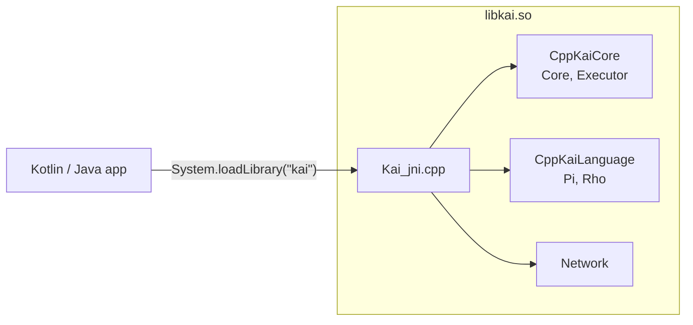

# Android

Everything needed to run the KAI runtime on Android.

```
Android/
  jni/Kai_jni.cpp     JNI bridge, the native side of libkai.so
```

With `-DKAI_ANDROID=ON`, the CMake `kai` target links the Android-reusable library subset (CppKaiCore, CppKaiLanguage and Network) plus `jni/Kai_jni.cpp` into a single **`libkai.so`**. An app loads it with `System.loadLibrary("kai")` and drives the runtime through its own Kotlin or Java JNI wrapper. Tau is not built for Android.



See [Doc/Android.md](../Doc/Android.md) for prerequisites, the toolchain, the build script and app integration.

## Quick paths

Command-line cross-compile (needs `ANDROID_NDK_HOME`, NDK r26+):

```bash
../Scripts/build-android.sh            # -> build-android-arm64-v8a/Bin/libkai.so
```

Downstream apps point their Gradle `externalNativeBuild` at the CppKAI root, pass `-DKAI_ANDROID=ON`, and load the resulting `libkai.so`.
