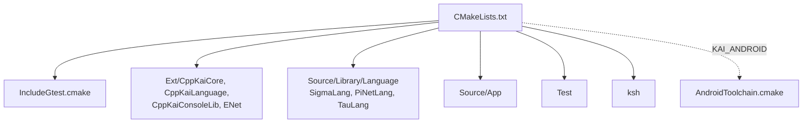

# CMake Modules

Helper CMake files used by the root `CMakeLists.txt`.

| File | Purpose |
|------|---------|
| `IncludeGtest.cmake` | Fetch and configure GoogleTest |
| `AndroidToolchain.cmake` | Android NDK cross-compilation (with `KAI_ANDROID=ON`) |
| `FindCocoa.cmake`, `FindCoreVideo.cmake`, `FindIOKit.cmake` | macOS frameworks |
| `FindPkgMacros.cmake` | Package-finding helpers |
| `cotire.cmake` | Precompiled headers and unity builds |
| `CMakeLists.txt.in` | Template used at configure time |

The options themselves (`KAI_NETWORKING`, `KAI_BUILD_IMGUI`, `KAI_BUILD_LLM`, `ENABLE_SHELL_SYNTAX` and the rest) are in the root `CMakeLists.txt`; see the [main README](../README.md#cmake-options) and [Doc/BUILD.md](../Doc/BUILD.md).

