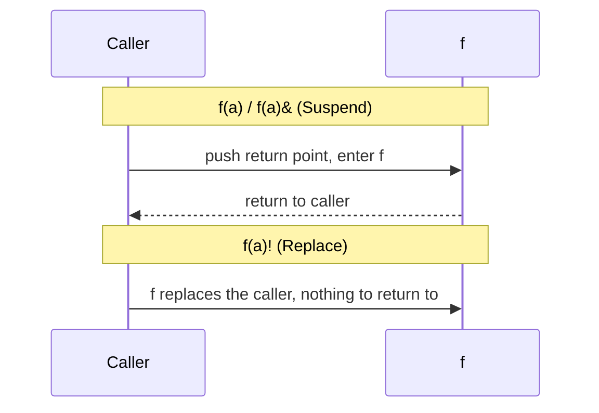

# DemoConintuationLocal

A static browser demo comparing the local continuation control forms in Rho, and the Pi each one becomes.

| Rho | Pi | What happens |
|-----|----|--------------|
| `f(a)`, `f(a)&` | `Suspend` | Push a return point; control comes back to the caller when the callee finishes |
| `f(a)...` | `Resume` | Switch to the callee without pushing a return point; the context stack is left as it is |
| `f(a)!` | `Replace` | Replace the current continuation with the callee, dropping the top context entry (a tail call) |

Sigma supports `&` and `!` with the same meaning; `...` is not yet available from Sigma. See [Sigma: continuation operators](../../Doc/Sigma/README.md#continuation-operators).

Open `index.html` in a browser. The page reuses `../ContinuationMobilityDemo/style.css`, shared styling from `../../SharedWeb/styles/kai-shared.css`, and its own `app.js`.
