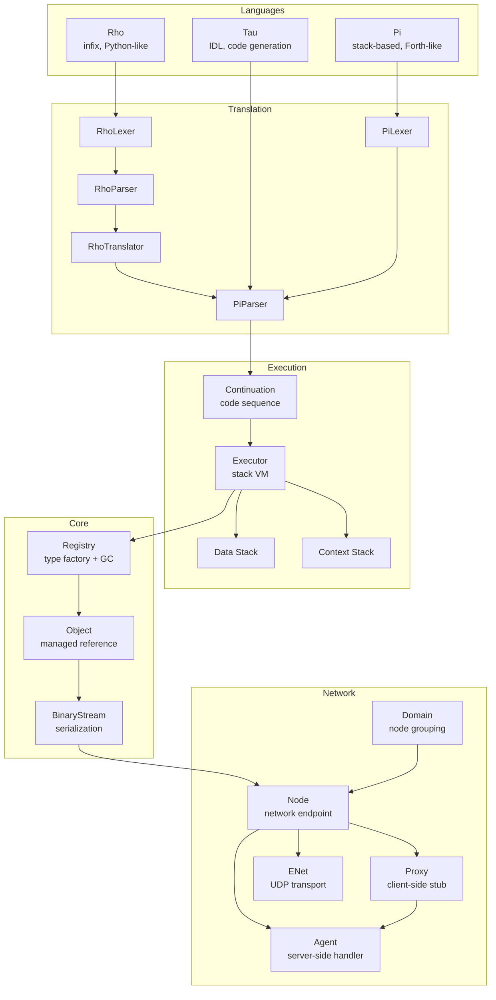
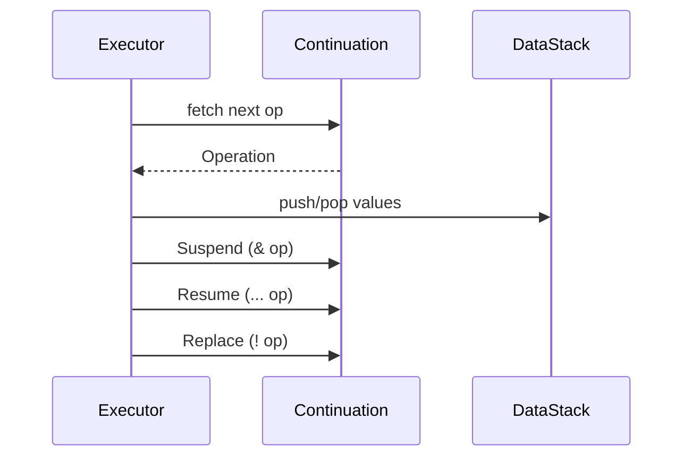
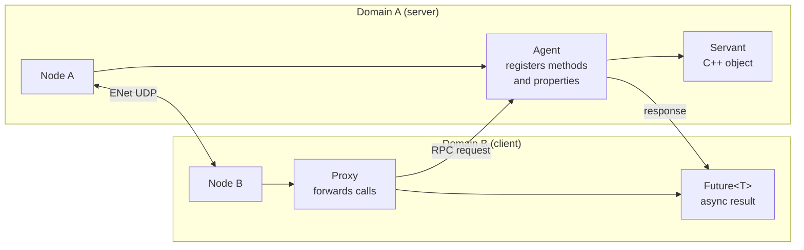

# KAI Architecture

## Overview

KAI is a distributed object model for C++ with full runtime reflection, incremental garbage collection, and a multi-language execution environment. Three languages — Pi, Rho, and Tau — share a common lexer/parser/executor pipeline, all running on a stack-based virtual machine.



## Core Concepts

### Registry and Object Model

The `Registry` is the central factory and garbage collector. Every value in KAI is wrapped in an `Object` — a managed, typed reference. Types are registered at startup:

```cpp
reg.AddClass<int>();
reg.AddClass<String>();
MyType::Register(reg);
```

No macros are required. The reflection system uses template specialisation and the `Traits<T>` machinery.

### Continuation-Based Execution

Rather than a traditional call stack, KAI uses **Continuations** — first-class objects that represent a sequence of operations. This enables:

- Suspension and resumption of execution mid-sequence
- Tail-call replacement (`!` in Pi)
- Coroutine-like patterns
- The `for`/`while`/`if` control structures are all implemented as continuations



### Translation Pipeline

Rho code is compiled to Pi, which is then executed directly:

```
Rho source
    → RhoLexer (tokens)
    → RhoParser (AST)
    → RhoTranslator (Pi operations)
    → Pi Continuation
    → Executor
```

Tau IDL is compiled offline to C++ proxy/agent headers — it does not run through the executor.

## Language Architecture

### Pi — Foundation Language

Pi is an assembly-like stack language. All other languages ultimately emit Pi operations. It uses two stacks:

| Stack | Purpose |
|-------|---------|
| Data stack | Values and intermediate results |
| Context stack | Continuations, scopes, control flow |

Key operations: `dup`, `drop`, `swap`, `over`, `@` (dereference), `!` (replace/store), `&` (suspend), `...` (resume).

### Rho — Application Language

Rho provides infix, Python-like syntax that transpiles to Pi. The translator generates Pi operations — it does not evaluate at translation time. This separation is critical: the executor owns all evaluation.

```rho
fun factorial(n) {
    if (n <= 1) { return 1 }
    else { return n * factorial(n - 1) }
}
```

### Tau — Interface Definition Language

Tau is a declarative IDL for defining network interfaces. `NetworkGenerate` reads `.tau` files and emits C++ headers:

```tau
namespace Calc {
    interface ICalc {
        Future<int> Add(int a, int b);
        int Value;
    }
}
```

Generates `ICalcProxy` (for callers) and `ICalcAgent` (for implementors). Template return types like `Future<int>` are handled by the lexer as a single composite token.

## Networking Architecture



### Agent/Proxy Pattern

- **Agent** registers on a `Node` and exposes methods/properties via `RegisterMethod` / `RegisterProperty`
- **Proxy** holds a `NetHandle` pointing to a remote agent and forwards typed calls via `Invoke<R>(...)` or `FetchProperty<T>(...)`
- **Domain** is a thin wrapper that groups a `Node` with factory methods `MakeAgent<T>()` / `MakeProxy<T>()`
- **`Future<T>`** is returned by all remote calls; `Node::WaitFor(future)` blocks until resolved

### Message Types

| ID | Decimal | Purpose |
|----|---------|---------|
| `ID_KAI_FUNCTION_CALL` | 129 | Client → Agent: invoke method |
| `ID_KAI_FUNCTION_RESPONSE` | 131 | Agent → Client: return value |
| `ID_KAI_EVENT` | 130 | Agent → all: broadcast event |
| `ID_KAI_OBJECT` | 128 | Node → all: broadcast KAI object |
| `ID_KAI_PROPERTY_GET` | 132 | Client → Agent: read property |
| `ID_KAI_PROPERTY_SET` | 133 | Client → Agent: write property |

## Design Patterns

| Pattern | Where used |
|---------|------------|
| Registry / Factory | `Registry::New<T>()` for all object creation |
| Visitor | AST traversal in all language translators |
| Observer | `SubscribeEvent`, `SetConnectionEventCallback` |
| Command | Operations are first-class `Object` values |
| Proxy | `ProxyBase` / `Proxy<T>` for remote calls |
| Template Method | `GenerateProcess` base drives `GenerateProxy` / `GenerateAgent` |

## Architectural Strengths

1. **Separation of concerns**: Lexing → Parsing → Translation → Execution are fully decoupled
2. **Extensibility**: New languages plug in by implementing the `LexerCommon` / `ParserCommon` interfaces
3. **Uniform object model**: Every value is an `Object`; the executor never handles raw C++ types
4. **First-class continuations**: `Suspend`/`Resume`/`Replace` enable powerful control-flow primitives without special VM support
5. **Zero-macro reflection**: Types are registered via template specialisation, no source modifications needed
