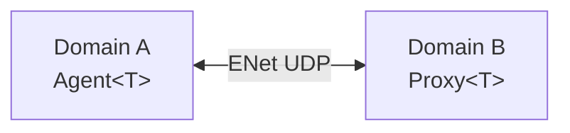

# KAI Language System Guide

The KAI system includes four integrated languages that serve different roles in the distributed computing environment. This guide provides an overview of these languages and links to detailed tutorials for each.

For an in-depth look at how these languages share a common underlying architecture, see the [Common Language System Architecture](CommonLanguageSystem.md) document.

## Language Overview

| Language | Purpose | Paradigm | Notable Features |
|----------|---------|----------|-----------------|
| **Pi** | Foundation language | Stack-based, RPN | Dual stacks, continuations, efficient execution |
| **Rho** | Application language | Infix, Python-like | Native continuations, Pi embedding, familiar syntax |
| **Sigma** | Typed application language | Infix, statically typed | Rho syntax plus types, checked before it runs, compiles to Rho |
| **Tau** | Interface definition | Declarative, IDL | Network proxies, distributed objects, code generation |

## Common Features

All four languages in the KAI system share several important characteristics:

1. **Type Safety**: Strong typing throughout the language system
2. **Network Awareness**: Designed for distributed computing
3. **Reflection**: Full runtime reflection capabilities
4. **Integration**: Seamless interoperability between languages
5. **Extensibility**: Easy to extend with new types and operations
6. **Binary Operations**: Strong support for arithmetic, logical, and bitwise operations 
7. **Control Structures**: Comprehensive control flow with proper nesting and scoping

## Pi: The Foundation

Pi is a stack-based language that serves as the foundation of KAI's language system. All other languages ultimately compile down to Pi operations.

Key characteristics:
- **Stack manipulation**: Operations like dup, swap, drop, and over
- **Dual stacks**: Data stack for values, context stack for control flow
- **RPN syntax**: Operations follow their operands
- **Direct execution**: Efficient runtime evaluation
- **Continuation control**: Powerful operations like Suspend, Resume, and Replace for advanced flow control

[Learn more in the Pi Tutorial](PiTutorial.md)

## Rho: The Application Language

Rho is an infix language designed for writing application logic. It combines a familiar Python-like syntax with powerful features like native continuations and direct Pi embedding.

Key characteristics:
- **Familiar syntax**: Infix notation, similar to Python or JavaScript
- **Pi integration**: Can embed Pi code blocks directly
- **Native continuations**: First-class support for advanced control flow
- **Comprehensive operators**: Full support for arithmetic, logical, comparison, and bitwise operations
- **Strong typing**: Type-safe operations with automatic conversions where appropriate
- **Control structures**: If/else conditions, for loops, while loops, and do-while loops
- **Function support**: Function definitions, recursion, and nested scopes
- **Translates to Pi**: Compiles to Pi operations for execution

[Learn more in the Rho Tutorial](RhoTutorial.md)

## Sigma: The Typed Language

Sigma (σ) is Rho's indentation-based syntax plus static types. Every program is type-checked before it runs, then compiled to Rho and from there to Pi, so a program with a type error never runs.

Key characteristics:
- **Static types**: `bool`, `int`, `float`, `str`, `List[T]`, `Map[str, V]`, `fun(T, ...) -> R`, `void`, `any`, and any C++ class registered with the Registry
- **Inference**: the first assignment to a name fixes its type
- **No truthiness**: conditions must be `bool`; the only implicit conversion is `int` to `float`
- **Errors before execution**: every type error is reported as `line:col: message`, and nothing runs
- **Same executor**: the type checker runs, then Sigma emits Rho, which runs on the same Pi executor as everything else

```sigma
fun gcd(a: int, b: int) -> int
    return b == 0 ? a : gcd(b, a % b)

g = gcd(48, 18)       // g: int, inferred
g = "six"             // 5:5: cannot assign to 'g': expected int, got str
```

[Learn more in the Sigma reference](Sigma/README.md)

## Tau: The Interface Definition Language

Tau is KAI's Interface Definition Language (IDL), designed for defining how components communicate across network boundaries.

Key characteristics:
- **Interface definitions**: Clear contracts between components
- **Code generation**: Creates proxies and agents for network communication
- **Type safety**: Ensures consistent type handling across the network
- **Field assignments**: Supports initialization of fields with literals and values
- **Default parameters**: Methods can have default parameter values
- **Numeric literals**: Full support for integer, float, and scientific notation
- **Versioning**: Supports backward compatibility

[Learn more in the Tau Tutorial](TauTutorial.md)

## Language Interoperability

One of KAI's most powerful features is the seamless interoperability between its languages:

### Rho ↔ Pi Integration

```rho
// Embedding Pi code directly in Rho
result = 10 + pi{ 3 4 + }  // result = 10 + 7 = 17

// Accessing Rho variables from Pi
x = 5
pi_result = pi{ x @ 2 * }  // pi_result = 10
```

### Sigma → Rho → Pi

Sigma compiles to Rho, so a Sigma program and a Rho program share the same executor and registry. A one-line `pi { ... }` block in Sigma passes through unchanged; its type is `any`, so its value must be stored in a variable with a declared type:

```sigma
n: int = pi { 2 3 + }       // 5
```

### Tau ↔ Implementation Language Integration

Tau definitions generate code that integrates with the implementation language (typically C++):

```cpp
// Using a Tau-generated proxy
auto userService = kai::Proxy<UserService>("node2:8080");
auto user = userService->GetUserById("user123");
```

## Advanced Rho Language Features

Recent enhancements to the Rho language have improved its capability and reliability:

### Binary Operations with Proper Precedence

Rho now fully supports complex expressions with proper operator precedence:

```rho
// Arithmetic with precedence
result = 2 + 3 * 4;  // 14 (multiplication before addition)
result = (2 + 3) * 4;  // 20 (parentheses override precedence)

// Mixed operations
result = 2 + 3 * 4 - 6 / 2;  // 11
```

### Enhanced Control Structures

Rho supports all standard control structures with proper nesting and scoping:

```rho
// If-else statements
if (condition) {
    // true branch
} else {
    // false branch
}

// For loops
for (i = 0; i < 10; i = i + 1) {
    // loop body
}

// While loops
while (condition) {
    // loop body
}

// Do-while loops
do {
    // loop body
} while (condition);
```

### Functions with Recursion

Rho supports full function definitions with parameters, return values, and recursion:

```rho
// Recursive function definition
function factorial(n) {
    if (n <= 1) {
        return 1;
    } else {
        return n * factorial(n - 1);
    }
}

// Function call
result = factorial(5);  // 120
```

### Scoping and Variable Management

Rho properly handles variable scoping, including nested scopes and shadowing:

```rho
// Variable scoping
x = 10;
{
    // New scope
    x = 20;  // Shadows outer x
    y = 30;  // Local to this scope
}
// x is still 10 here
// y is not accessible here
```

## Choosing the Right Language

When working with KAI, choose the appropriate language based on your needs:

- **Pi**: For low-level operations, stack manipulation, or when maximum efficiency is required
- **Rho**: For application logic, algorithms, or when readability and familiarity are priorities
- **Sigma**: For code that should be checked before it runs: libraries, code that crosses a network boundary, and anything large enough that a typo should not surface at runtime
- **Tau**: For defining interfaces between distributed components or services

## Development Workflow

A typical development workflow with KAI's language system might look like:

1. Define component interfaces using **Tau**
2. Implement application logic using **Rho**, or **Sigma** where it should be type-checked
3. Optimize performance-critical sections with **Pi**
4. Connect components across the network using Tau-generated proxies

## Tools and Environment

KAI provides several tools for working with its languages:

- **Console**: Interactive REPL for Pi, Rho and Sigma
- **Code generators**: For processing Tau IDL files
- **Debuggers**: For tracing execution and viewing stack state
- **Network monitors**: For tracking distributed object communication

## Getting Started

The best way to get started with KAI's language system is to:

1. Learn basic Pi operations from the [Pi Tutorial](PiTutorial.md)
2. Become familiar with Rho syntax using the [Rho Tutorial](RhoTutorial.md)
3. Add static types with [Sigma](Sigma/README.md)
4. Understand distributed object modeling with the [Tau Tutorial](TauTutorial.md)
5. Learn about advanced control flow with the [Continuation Control documentation](ContinuationControl.md)
6. Experiment with the Console application to try examples

## Recent Improvements (2026)

### Executor: Early Returns

Two executor bugs that lost an early `return` are fixed (in CppKaiCore):

- a `return` inside an `if`, in a function called from a `for` or `while` body
- a `return` in an `if` block that calls a function first, such as `if n > 1: return n * fact(n - 1)`, which used to return from the `if` only

`TestRho`'s `RhoEarlyReturnInLoop` tests and `SigmaTests.EarlyReturnInFunctionCalledFromLoop` (no longer disabled) cover both.

### Sigma: Continuation Operators

Sigma accepts Rho's `f(x)&` (suspend) and `f(x)!` (a tail call), written directly after the `)`. See [Continuation operators](Sigma/README.md#continuation-operators).

### Sigma: Statically Typed Layer

Sigma, a new statically typed language with Rho's syntax, lives in CppKAI (`Include/KAI/Language/Sigma`, `Source/Library/Language/Sigma`, the `SigmaLang` library). The Console registers it through `Console::AddTranslator`, so CppKaiCore and CppKaiConsoleLib do not depend on it. `TestSigma` covers it with unit tests and example programs. See [Doc/Sigma](Sigma/README.md).

### Tau — Template Return Type Parsing

`Future<T>` return types in Tau IDL interfaces now parse correctly:

```tau
interface ICalc {
    Future<int> Add(int a, int b);  // was: parser failed here
}
```

The fix is in `TauLexer`: after lexing an alpha identifier, if the next character is `<`, the lexer now extends the token to include the full angle-bracket expression, making `Future<int>` a single `Ident` token. This allows `TauParser::Interface` to correctly identify the method name that follows.

### Networking — Domain/Agent/Proxy

KAI now has a complete peer-to-peer RPC system:



- `BindMethod` / `BindMemberProperty` on an `Agent<T>` registers C++ methods and properties
- `Proxy<T>::Call<R>()`, `Get<P>()`, `Set<P>()` forward typed calls remotely
- `Future<T>` / `Node::WaitFor()` provide synchronous resolution of async calls

### Rho — Python-Style Iteration (2025)

- `for x in container` syntax
- `break` and `continue` in all loop types
- Pi keyword validation — rejects `max`, `min`, etc. as Rho variable names

For details on the Rho translator architecture, see [Rho Fix Documentation](Rho-Fix-Documentation.md).

## Conclusion

KAI's integrated language system provides a powerful foundation for distributed computing. By combining the efficiency of Pi, the expressiveness of Rho, the static checking of Sigma, and the interface clarity of Tau, developers can build robust distributed applications that scale across networks.

For more detailed information on each language, please refer to the specific tutorials linked above.