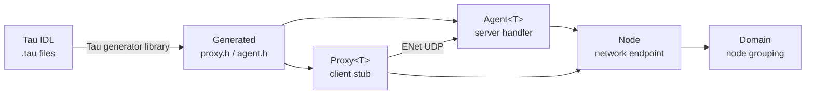

# KAI Network Documentation

Central index for all networking documentation.

## Architecture



## Documents

| Document | Contents |
|----------|----------|
| [PeerToPeerNetworking.md](PeerToPeerNetworking.md) | Node/Domain/Agent/Proxy architecture, wire protocol, quick-start |
| [TauTutorial.md](TauTutorial.md) | Tau IDL syntax for defining network interfaces |
| [NetworkSecurity.md](NetworkSecurity.md) | Security considerations and future plans |
| [NetworkIteration.md](NetworkIteration.md) | Distributed iteration patterns |
| [NetworkCalculationTest.md](NetworkCalculationTest.md) | Example distributed calculation |

## Core Components

| Header | Purpose |
|--------|---------|
| `KAI/Network/Node.h` | Network endpoint — listen, connect, send, receive |
| `KAI/Network/Domain.h` | Groups a Node with `MakeAgent<T>()` / `MakeProxy<T>()` |
| `KAI/Network/Agent.h` | Server-side object; `BindMethod`, `BindMemberProperty` |
| `KAI/Network/Proxy.h` | Client-side stub; `Call<R>()`, `Get<P>()`, `Set<P>()` |
| `KAI/Network/ProxyBase.h` | Base for proxies: `Exec`, `Fetch`, `Store` |
| `KAI/Network/AgentBase.h` | Base for agents: registers handle with Node |
| `KAI/Network/Future.h` | Async result type returned by all remote calls |
| `KAI/Network/Transport.h` | `SendReliability`, `SendRouting`, `BufferOffset` enums |
| `KAI/Network/Serialization.h` | Wire message IDs and serialization helpers |

## Build

Networking is enabled by default:

```bash
./Scripts/b                     # standard build includes ENet, Tau IDL libraries, and network tests
./Scripts/b --clean             # clean rebuild with networking included

cmake .. -DKAI_NETWORKING=OFF   # equivalent CMake flag to disable networking
```

The `KAI_NETWORKING` option controls:
- ENet library
- `Network` library
- `TauLang` (needed for IDL code generation)
- Tau generator library APIs
- `TestNetwork` test binary
- `TestTau` language tests

## Running Network Tests

```bash
./Bin/Test/TestNetwork
./Bin/Test/TestNetwork --gtest_filter="NodeEndToEndTest*"
./Bin/Test/TestNetwork --gtest_filter="TauDomain*"
```

## FAQ

**Q: Is KAI networking peer-to-peer or client-server?**
Symmetric P2P — every `Node` can both listen and connect. Roles (agent = server, proxy = client) are per-object, not per-node.

**Q: What transport is used?**
ENet over UDP (reliable and unreliable channels both supported via `SendReliability` enum).

**Q: How do I expose a C++ method over the network?**
Create an `Agent<MyClass>`, call `BindMethod("Name", &MyClass::Method)`. The other side creates a `Proxy<MyClass>` and calls `proxy.Call<ReturnType>("Name", args...)`.

**Q: How do I generate proxy/agent code from a `.tau` file?**
Use the Tau generator library (`tau::Generate::*`) from an application or build
tool. The old `NetworkGenerate` command-line executable is no longer built.
