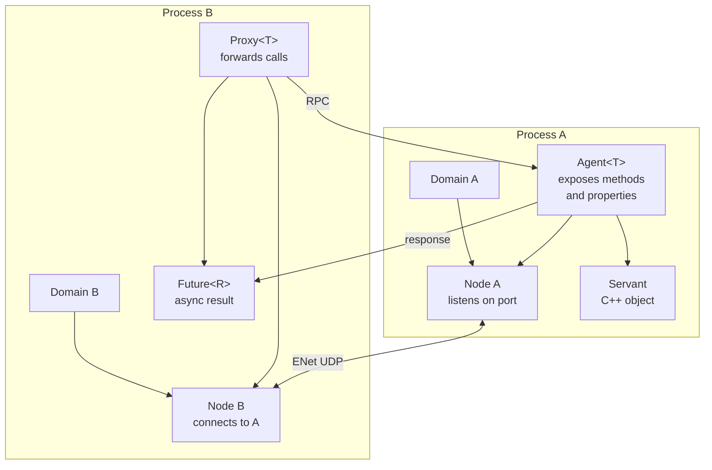
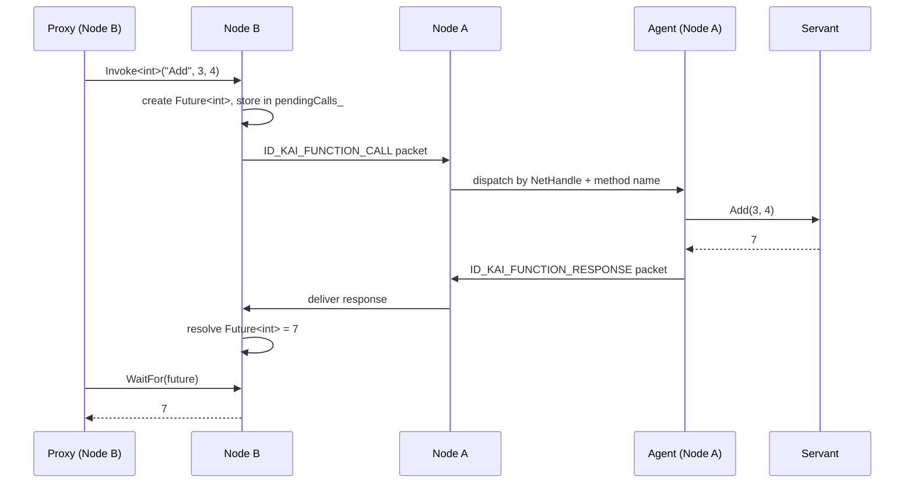

# KAI Peer-to-Peer Networking

KAI's networking layer provides a symmetric peer-to-peer model: every `Node` can both listen for incoming connections and connect outward. There are no designated servers or clients — any node can host agents and any node can hold proxies.

The transport is **ENet over UDP**. Networking is built by default and can be disabled with `KAI_NETWORKING=OFF`:

```bash
./b
```

## Core Abstractions



| Type | Role |
|------|------|
| `Node` | Network endpoint. Listens, connects, dispatches packets |
| `Domain` | Groups a `Node` with factory methods for agents and proxies |
| `Agent<T>` | Registers a C++ object's methods and properties for remote access |
| `Proxy<T>` | Forwards typed calls to a remote agent via `NetHandle` |
| `Future<T>` | Asynchronous result; resolved by `Node::WaitFor()` |
| `NetHandle` | Opaque handle that identifies an agent across node boundaries |

## Quick Start

### Domain A — hosting a service

```cpp
Node nodeA;
nodeA.SetRegistry(&registry);
nodeA.Listen(IpAddress("127.0.0.1"), 14600);

// The agent registers its methods on the node
class ICalcAgent : public Agent<Calculator> {
public:
    ICalcAgent(Node& node) : Agent<Calculator>(node) {
        BindMethod("Add", &Calculator::Add);
        BindMemberProperty("Value", &Calculator::value);
    }
};

ICalcAgent agent(nodeA);
```

### Domain B — calling the service

```cpp
Node nodeB;
nodeB.SetRegistry(&registry);
nodeB.Connect(IpAddress("127.0.0.1"), 14600);

// Wait for connection ...

// Tell B where the agent lives
NetAddress addr("127.0.0.1", 14600);
nodeB.BindProxyAddress(agent.Handle(), addr);

ICalcProxy proxy(nodeB, agent.Handle());
Future<int> result = proxy.Add(3, 4);
int value = nodeB.WaitFor(result);  // 7
```

## Call Flow



## Properties

Agents can expose typed properties (read-only or read-write):

```cpp
// Bind a member variable directly
agent.BindMemberProperty("Value", &Sensor::value);

// Or provide explicit getter/setter
node.RegisterProperty<int>(
    handle, "Counter",
    []() -> int { return counter_; },
    [](int v) { counter_ = v; });
```

From Domain B:

```cpp
auto getFuture = nodeB.FetchProperty<int>(handle, "Counter");
int current = nodeB.WaitFor(getFuture);

auto setFuture = nodeB.StoreProperty<int>(handle, "Counter", 99);
nodeB.WaitFor(setFuture);
```

## Events

Agents broadcast events to all connected peers:

```cpp
// Server broadcasts
BinaryStream payload;
payload.Write(static_cast<int>(score));
node.BroadcastEvent("ScoreUpdated", payload);

// Client subscribes
node.SubscribeEvent("ScoreUpdated", [](BinaryPacket& pkt) {
    int score;
    pkt.Read(score);
});
```

## Tau IDL Integration

Define an interface in Tau and let `NetworkGenerate` produce the proxy and agent:

```tau
namespace Calc {
    interface ICalc {
        Future<int> Add(int a, int b);
        int Value;
        event ResultReady(int result);
    }
}
```

```bash
./Bin/NetworkGenerate Calc.tau
# produces: Calc.proxy.h  Calc.agent.h
```

The generated `ICalcProxy` inherits from `ProxyBase` and the generated `ICalcAgent` inherits from `AgentBase`. Their constructors automatically register all methods and properties with the `Node`.

## Building

```bash
# Enable networking
./b --network

# Run network tests
./Bin/Test/TestNetwork

# Run specific suite
./Bin/Test/TestNetwork --gtest_filter="TauDomainPropertyTest*"
```

## Wire Protocol

| Message ID | Dec | Direction | Payload |
|------------|-----|-----------|---------|
| `ID_KAI_OBJECT` | 128 | Node → all | serialized KAI object |
| `ID_KAI_FUNCTION_CALL` | 129 | Proxy → Agent | handle, futureId, name, args |
| `ID_KAI_EVENT` | 130 | Agent → all | name, optional payload |
| `ID_KAI_FUNCTION_RESPONSE` | 131 | Agent → Proxy | futureId, return value |
| `ID_KAI_PROPERTY_GET` | 132 | Proxy → Agent | handle, futureId, name |
| `ID_KAI_PROPERTY_SET` | 133 | Proxy → Agent | handle, futureId, name, value |

## Security Notes

The current implementation provides no authentication or encryption. For production use:

- Wrap ENet sockets with TLS (e.g. via DTLS)
- Validate `NetHandle` values before dispatching to agents
- Rate-limit incoming `ID_KAI_FUNCTION_CALL` packets per peer
