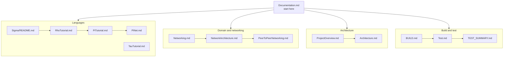

# KAI Documentation

Documentation for the KAI distributed object model and its languages. For the project overview, start with the [main README](../README.md).

## Quick Start

- **[BUILD.md](BUILD.md)**: building from source, all platforms and CMake options
- **[Install.md](Install.md)**: installation
- **[Android.md](Android.md)**: building the Android library subset
- **[Documentation.md](Documentation.md)**: main documentation index
- **[Test.md](Test.md)**: running the test suites and filtering failures

## Current Status

- Networking is built by default (`KAI_NETWORKING=ON`); pass `-DKAI_NETWORKING=OFF` to skip it.
- Shell backtick syntax is off by default (`ENABLE_SHELL_SYNTAX=OFF`).
- **[TEST_SUMMARY.md](TEST_SUMMARY.md)** is the current test snapshot and **[TODO.md](TODO.md)** tracks known gaps and failing tests.
- **[REVIEW.md](REVIEW.md)** is the current architectural and code review.

## Languages

| Language | Reference | Role |
|----------|-----------|------|
| Sigma (σ) | [Sigma/README.md](Sigma/README.md), [Sigma.md](Sigma.md) (continuation operators) | Statically typed; compiles to Rho |
| Rho (ρ) | [RhoTutorial.md](RhoTutorial.md), [RhoLanguage.md](RhoLanguage.md) | Infix scripting; compiles to Pi |
| Pi (π) | [PiTutorial.md](PiTutorial.md), [Meaning.md](Meaning.md), [ClosuresVsContinuations.md](ClosuresVsContinuations.md), [ContinuationControl.md](ContinuationControl.md) | RPN bedrock; runs on the Executor |
| PiNet | [PiNet.md](PiNet.md) | What a continuation may reference to be sent to another node |
| Tau | [TauTutorial.md](TauTutorial.md), [TauFormalDefinition.md](TauFormalDefinition.md), [TauArchitectureDiagrams.md](TauArchitectureDiagrams.md), [TauCodeGeneration.md](TauCodeGeneration.md) | IDL; generates Agents and Proxies |

- **[LanguageGuide.md](LanguageGuide.md)**: how the four languages fit together
- **[Languages.md](Languages.md)**: the shared language-construction system
- **[CommonLanguageSystem.md](CommonLanguageSystem.md)**: `Language/Common` in detail

## Architecture

- **[Manifesto.md](Manifesto.md)**: what KAI is for
- **[ProjectOverview.md](ProjectOverview.md)**: CppKAI and its submodules
- **[Architecture.md](Architecture.md)**: system architecture
- **[DistributedGarbageCollection.md](DistributedGarbageCollection.md)**: GC across nodes
- **[EventSystem.md](EventSystem.md)**: events and callbacks ([EventExample.cpp](EventExample.cpp))

## Domain and Networking

- **[NetworkDocumentation.md](NetworkDocumentation.md)**: networking index
- **[Networking.md](Networking.md)**: overview
- **[NetworkArchitecture.md](NetworkArchitecture.md)**: Node, Domain, Agent, Proxy
- **[PeerToPeerNetworking.md](PeerToPeerNetworking.md)**: peer-to-peer Domains
- **[NetworkTauInterfaces.md](NetworkTauInterfaces.md)**: network interfaces in Tau
- **[NetworkSecurity.md](NetworkSecurity.md)**: security
- **[NetworkPerformance.md](NetworkPerformance.md)**: performance

## Console

- **[Console.md](Console.md)**: the interactive console
- **[CONSOLE_NETWORKING.md](CONSOLE_NETWORKING.md)**: console-to-console networking
- **[ColorOutput.md](ColorOutput.md)**: colour and formatting

## Testing

- **[Test.md](Test.md)**: testing guide
- **[TEST_SUMMARY.md](TEST_SUMMARY.md)**: current status
- **[LogFormat.md](LogFormat.md)**: test runner log format

## Tooling and Maintenance

- **[LmmReadme.md](LmmReadme.md)**: local model cache, `RepoIndex`, `RhoDataset`
- **[StyleGuide.md](StyleGuide.md)**: code style
- **[OUT_OF_SOURCE_BUILD.md](OUT_OF_SOURCE_BUILD.md)**: out-of-source builds
- **[TODO.md](TODO.md)**: tracked gaps, in-progress work, known-failing tests
- **[COMPARE_RUST.md](COMPARE_RUST.md)**: comparison with a Rust approach

## Historical and Superseded Reports

These are point-in-time investigation notes, fix write-ups and status reports. They describe past states of the code; do **not** treat them as current. Where they conflict with TODO.md, TEST_SUMMARY.md or REVIEW.md, those three are authoritative.

- Code reviews: `core_review.md`, `core_review_updated.md`, `KAI_Review.md` (superseded by [REVIEW.md](REVIEW.md))
- Rho investigation notes: `Rho-Analysis.md`, `Rho-Findings.md`, `Rho-Fix.md`, `Rho-Fix-Documentation.md`, `Rho-Issues.md`, `Rho-Regression-Analysis.md`, `RhoSemicolonIssue.md`, `RhoTestFailureAnalysis.md`, `RhoTestStatusUpdate.md`, `RhoIterationMethodsReport.md`, `RhoModelTrainingPlan.md`
- Tau investigation notes: `Tau-Analysis.md`
- Test status snapshots: `TEST_BASELINE_REPORT.md`, `test_summary_report.md`, `Test-Fixes-Summary.md`, `Test-Improvements.md`, `Test-Suite-Summary-Feature.md`, `Test-Summary-Feature.md`, `TestStatusFinal.md`, `DisabledTestsAnalysis.md`
- Control-flow fix write-ups: `DoWhileStatus.md`, `DoWhileCombinedTestsDescription.md`, `WhileAndDoWhileTestsDescription.md`
- Migration and fix write-ups: `SmartPointerMigration.md`, `SmartPointerMigrationPlan.md`, `SmartPointerMigrationProgress.md`, `NullRegistryFix.md`, `raw_pointer_analysis.md`, `fixes-summary.md`, `future_work.md`
- Networking session notes: `ConnectionTesting.md`, `NetworkCalculationTest.md`, `NetworkIteration.md`, `NetworkingChanges.md`, `PeerToPeerSummary.md`, `PROJECT_ANALYSIS.md`

## Related

- [Main README](../README.md)
- [Examples](../Examples/README.md)
- [Tests](../Test/README.md)
- [Architecture diagrams](../resources/README.md)

## Documentation Standards

1. Markdown, with clear headings and code examples
2. Link to related documentation
3. Keep it current with the code; update TODO.md and TEST_SUMMARY.md together whenever test status changes
4. A one-off investigation or fix write-up belongs under Historical, not the main navigation; fold anything still true into the relevant living doc instead of leaving it as a standalone file
