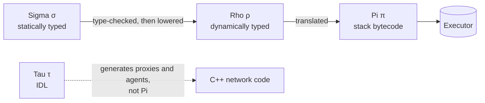
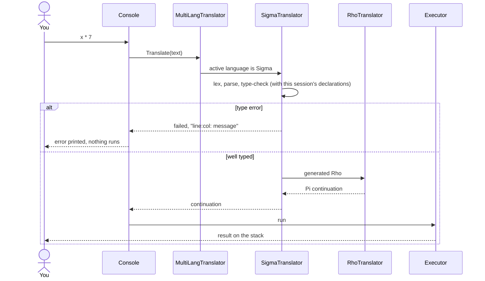
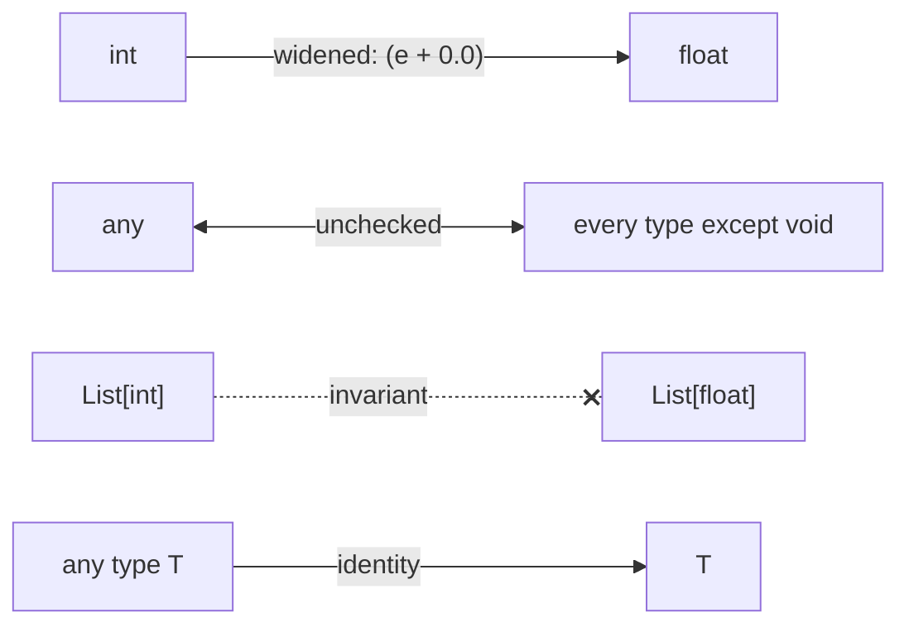
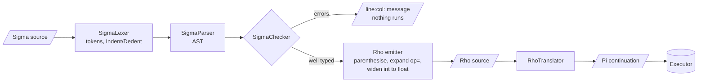
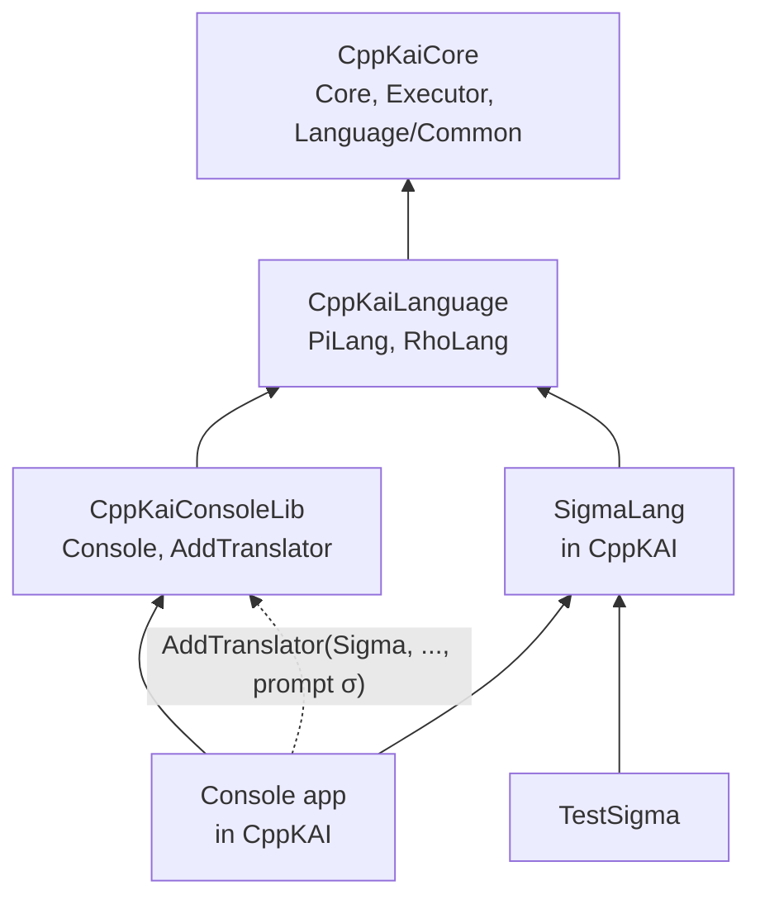

# Sigma (σ)

Sigma is KAI's statically typed language. It has Rho's indentation-based
syntax plus types, and it compiles to Rho, which compiles to Pi. Every program
is type-checked before it runs; a program with a type error does not run at
all.

```sigma
fun mean(xs: List[float]) -> float
    total: float = 0
    for x in xs
        total += x
    return total / xs.size()

samples: List[float] = [2, 4, 4, 5]
m = mean(samples)          // m: float, inferred
m                          // 3.75
```

Sigma exists for code that should be checked before it runs: libraries other
code depends on, anything that crosses a network boundary, and anything large
enough that a typo should not surface at runtime. Rho stays the quick,
dynamically typed scripting layer, and both run on the same Pi executor.



## Contents

- [Running Sigma](#running-sigma)
- [Types](#types)
- [Declarations](#declarations)
- [Functions](#functions)
  - [Continuation operators](#continuation-operators)
  - [Templates](#templates)
  - [Variadic templates](#variadic-templates)
- [Statements](#statements)
- [Expressions](#expressions)
- [Lists and maps](#lists-and-maps)
- [Native C++ types](#native-c-types)
- [Pi blocks and `any`](#pi-blocks-and-any)
- [Errors](#errors)
- [How Sigma compiles](#how-sigma-compiles)
- [Not supported yet](#not-supported-yet)
- [Known issues](#known-issues)
- [Source and tests](#source-and-tests)

## Running Sigma

**Console.** Type `sigma` to switch language; the prompt becomes `Sigma σ`.
`rho` and `pi` switch back.

```
Pi λ sigma
Sigma σ x: int = 6
Sigma σ fun sq(n: int) -> int
Sigma ...     return n * n
Sigma ...
Sigma σ sq(x)
[0]: 36
Sigma σ y: int = "s"
1:10: cannot initialise 'y': expected int, got str
```

- A line that opens a block (`fun`, `if`, `while`, `for`, `do`) continues on
  the next line until you enter an empty line. Unclosed brackets also
  continue.
- Declarations carry over from one input to the next, so `x` above is still
  an `int` in later lines. A name can be declared again only with the same
  type.

What happens to one line of input:



**Command line.** `Console -l sigma` starts in Sigma, and `Console file.sigma`
runs a file as Sigma.

**C++.** `SigmaTranslator` is an ordinary KAI translator. Register it with a
console, or use it directly:

```cpp
#include <KAI/Language/Sigma/SigmaTranslator.h>

// In a console (this is what the Console app does):
console.AddTranslator(Language::Sigma,
                      std::make_shared<kai::SigmaTranslator>(console.GetRegistry()),
                      /*indentedBlocks*/ true, /*prompt*/ "σ");
console.SetLanguage(Language::Sigma);

// Or on its own:
kai::SigmaTranslator sigma(registry);
Pointer<Continuation> program = sigma.Translate(text, Structure::Program);
if (sigma.failed) std::cerr << sigma.error;    // one "line:col: message" per line

// Check and compile without running:
if (sigma.Compile(text)) std::cout << sigma.GetRho();
else for (auto const &e : sigma.GetErrors()) std::cerr << e << '\n';
```

## Types

| Type | Values |
|------|--------|
| `bool` | `true`, `false` |
| `int` | `42` |
| `float` | `2.5` |
| `str` | `"text"` or `'text'` (`string` is an alias) |
| `List[T]` | `[1, 2, 3]` |
| `Map[str, V]` | `{"a": 1, "b": 2}`; keys are string literals |
| `fun(T, ...) -> R` | any named function with that signature |
| `T` | a [template](#templates)'s type parameter |
| `void` | function results only |
| `any` | an explicit escape hatch; never inferred |
| *ClassName* | any C++ class registered with the Registry |

- Generics are invariant: a `List[int]` is not a `List[float]`.
- The only implicit conversion is `int` to `float`. It applies wherever a
  `float` is expected: declarations, assignments, arguments, returns, list
  and map elements, and conditional branches.

Which values can be stored where:



## Declarations

```sigma
x: int = 5            // declared with a type
y = x * 2             // first assignment declares y; its type, int, is fixed
y = 3                 // fine
y = "three"           // error: cannot assign to 'y': expected int, got str
ratio: float = 1      // int widens to float
xs: List[int] = []    // an empty list needs a declared type
```

- Every name must be declared before it is used, and every declaration has
  an initial value.
- A name cannot be declared again in an inner scope. Rho would assign to the
  outer variable rather than create a new one, so Sigma rejects it instead of
  letting the two disagree.
- `if`, `while` and `for` bodies do not open a new scope. A loop variable
  belongs to the enclosing scope, as in Rho.

## Functions

```sigma
fun gcd(a: int, b: int) -> int
    return b == 0 ? a : gcd(b, a % b)

fun log(message: str)            // no '-> T': returns void
    print(message)

fun apply(f: fun(int) -> int, x: int) -> int
    return f(x)
```

- Every parameter has a type.
- Without `-> T` a function returns `void`. A function with a result must
  return a value on every path, and a `void` function cannot return one.
- Functions are defined at the top level. They can be called before their
  definition, and they can be mutually recursive.
- Parameters are local; a parameter may share a name with a global.
- A function body sees every global the program declares, even ones declared
  after the function, because Rho resolves names when the function is
  called.
- A named function is a value of its `fun(...)` type. It can be stored in a
  variable of that type and passed as an argument.

### Continuation operators

A call can end in one of Rho's continuation operators, written directly
after the `)` with no space:

| Sigma | Rho / Pi | Meaning |
|-------|----------|---------|
| `f(x)` | `Suspend` | an ordinary call |
| `f(x)&` | `Suspend` | the same, written out; same type as `f(x)` |
| `f(x)!` | `Replace` | a tail call: `f` takes the place of the running function |

```sigma
fun sum(n: int, acc: int) -> int
    if n == 0
        return acc
    return sum(n - 1, acc + n)!      // tail call

total = sum(100, 0)                  // 5050
```

- With a space the operator means something else: `f(x) & mask` is a bitwise
  and, and `f(x) !` is a syntax error.
- `!` is only allowed as the last statement of a function body: `return
  f(...)!`, or `f(...)!` on its own in a `void` function calling a `void`
  function. It is rejected inside `if`, `while` and `for` bodies, in
  expressions, and outside functions.
- The callee must return exactly the function's result type. `int` is not
  widened to `float`, because no code of the calling function runs after a
  tail call.
- `&` and `!` apply to calls of Sigma functions, including function values,
  but not to `print` or methods.
- `...` (resume) is not supported; see [Not supported yet](#not-supported-yet).

### Templates

A function can take type parameters in square brackets. They work like C++
templates: the type arguments are inferred from each call, and the body is
type-checked once for each distinct set of them.

```sigma
fun max[T](a: T, b: T) -> T
    return a > b ? a : b

fun mapList[A, B](f: fun(A) -> B, xs: List[A]) -> List[B]
    out: List[B] = []
    for x in xs
        out.push(f(x))
    return out

max(3, 9)                  // max[int]: 9
max("pear", "apple")       // max[str]: "pear"
max(1, 2.5)                // max[float]: 2.5, the 1 is widened
mapList(isEven, [1, 2])    // mapList[int, bool]: List[bool]
```

- A type parameter can be used anywhere a type can in the signature and the
  body: `x: T = ...`, `List[T]`, `fun(T) -> U`.
- Every type parameter must appear in a parameter's type, since that is the
  only place it can be inferred from. There is no explicit `f[int](x)`.
- A parameter declared as plain `T` may receive ints and floats in the same
  call; `T` is then `float` and the ints are widened. Inside `List`, `Map`
  or `fun` types the arguments must agree exactly, as generics are invariant.
- The body is checked on its own first, with the type parameters unknown, so
  mistakes that don't depend on them (an undefined name, a missing return)
  are reported even if the template is never called. Everything else is
  checked per instantiation, and an error names the instantiation:

  ```
  2:14: operator '>' cannot be applied to List[int] and List[int] (in max[List[int]])
  ```

  An error in the body is reported once, however many instantiations hit it.
- Rho is untyped, so a template compiles to one ordinary Rho function. For
  that reason an int-to-float conversion inside the body must happen for
  every instantiation or for none: `fun g[T](x: T) -> float` returning `x`
  is an error if it is called with both an `int` and a `float`.
- A template can only be called; it cannot be stored in a variable or
  passed as a function value.
- Templates may call other templates and themselves, including with `!`.

### Variadic templates

The last type parameter can be a pack, `...Ts`, and then the last parameter
takes any number of arguments of any types: `xs: Ts...`.

```sigma
fun sum[...Ts](xs: Ts...) -> int
    return (xs + ... + 0)

fun maxOf[T, ...Ts](first: T, rest: Ts...) -> T
    if rest.size() == 0
        return first
    else
        m = maxOf(rest...)
        return first > m ? first : m

sum(1, 2, 3)                 // 6
sum()                        // 0
maxOf("pi", "rho", "sigma")  // "sigma"
```

A pack can only be used in three ways:

| Use | Meaning |
|-----|---------|
| `f(a, xs...)`, `[a, xs...]` | expanded into arguments or list elements |
| `(xs op ...)`, `(xs op ... op init)` | folded from the right: `x0 op (x1 op (... op init))` |
| `(... op xs)`, `(init op ... op xs)` | folded from the left: `((init op x0) op x1) op ...` |
| `xs.size()` | its length, a constant in each instantiation |

- Folds take `+ - * / % && || & | ^`. Folding an empty pack needs an initial
  value, except `&&` (giving `true`) and `||` (giving `false`).
- An `if` or `?:` whose condition depends on a pack's length, such as
  `rest.size() == 0`, is decided per instantiation, like C++'s
  `if constexpr`: only the branch taken is checked and emitted. That is what
  lets head/tail recursion stop. Code after such an `if` is always checked,
  so put the recursive case in its `else`.
- Packs may be heterogeneous: `count(1, "a", 2.5)` binds `Ts` to
  `int, str, float`. Pack elements are never widened from `int` to `float`,
  since each is passed through by name.
- Rho functions have a fixed number of parameters, so a variadic template
  is emitted once per pack length used: `sum(1, 2)` calls
  `fun sum__2(xs__0, xs__1)`. A template is checked once per distinct set of
  type arguments, and int-to-float widening must agree across instances of
  the same length.
- A variadic template is not checked until it is called, since what its body
  means depends on the pack.

## Statements

```sigma
if n > 0
    ...
else if n < 0
    ...
else
    ...

while i < 10
    ...

do
    ...
while i < 10

for i = 0; i < n; i += 1
    ...

for x in xs                // xs must be a List
    ...

break
continue
return value
assert(condition)
print(value)
x += 1                     // also -= *= /= %=, on a plain name
a = 1; b = 2               // ';' separates statements on one line
// comments run to the end of the line
```

- Blocks are indented by one tab or four spaces per level, as in Rho.
- Conditions (`if`, `while`, `do ... while`, `for`, `?:`, `assert`) must be
  `bool`. There is no truthiness.
- `break` and `continue` are only valid inside loops, and `return` only
  inside functions.

## Expressions

From lowest to highest precedence:

| Operators | Operands |
|-----------|----------|
| `c ? a : b` | `bool` condition, branches of one type (or `int` and `float`) |
| `\|\|` | `bool` |
| `&&` | `bool` |
| `\|` | `int` |
| `^` | `int` |
| `&` | `int` |
| `==` `!=` | two values of the same type, or two numbers |
| `<` `>` `<=` `>=` | two numbers or two strings |
| `<<` `>>` | `int` |
| `+` `-` | numbers; `+` also joins two strings or two lists of the same type |
| `*` `/` `%` | numbers |
| `-` `+` (prefix) | numbers |
| `!` (prefix) | `bool` |
| `~` (prefix) | `int` |
| `f(...)` `a[i]` `a.m` | must follow a name |
| `f(...)&` `f(...)!` | continuation operators, written directly after the `)` |

- `int` with `int` gives `int`, so `7 / 2` is `3`. If either operand is a
  `float`, the result is a `float`.
- Calls, indexing and `.` must follow a name: `g[1][0]` and
  `xs.slice(1, 3).size()` are fine, but `[1, 2][0]` is rejected, because Rho
  would read it as two separate expressions.

## Lists and maps

| Expression | Type |
|------------|------|
| `xs[i]` | `T`, with `i: int` |
| `xs.size()` | `int` |
| `xs.push(v)` | `void`, with `v: T` |
| `xs.slice(a, b)` | `List[T]` |
| `m[k]` | `V`, with `k: str` |
| `m.keys()` | `List[str]` |
| `m.size()`, `s.size()` | `int` |

The element type of a list literal is the common type of its elements:
identical types, or `int` and `float` mixed (the ints are widened). Anything
else is an error, as is an empty literal without a declared type.

## Native C++ types

Any class registered with the Registry can be used as a type by its
registered name. Method calls are checked against the signatures
`ClassBuilder` records (argument count, argument types and result type), and
property reads against the property's field type.

```sigma
fun describe(s: MyStruct) -> str
    n: int = s.Method0()
    return s.Method1(n, "x")
```

## Pi blocks and `any`

A one-line `pi { ... }` block is passed through to Rho unchanged. Its type is
`any`, so its value must be stored in a variable declared with a type:

```sigma
n: int = pi { 2 3 + }       // 5
x = pi { 1 }                // error: cannot infer a type for 'x' from 'any'
```

Values of type `any`, including Pi blocks, are not checked at runtime. A
wrong declaration there is the one way a Sigma program can still hit a
runtime type error.

## Errors

Errors are reported as `line:column: message`, one per line, sorted by
position. The type checker reports every type error it finds; lexical and
syntax errors stop at the first one.

```sigma
fun area(w: int, h: int) -> int
    return w * h

a = area(3, "4")
a = "big"
b: bool = a > 10 ? 1 : 0
```

```
4:13: argument 2 of 'area': expected int, got str
5:5: cannot assign to 'a': expected int, got str
6:20: conditional branch: expected bool, got int
6:24: conditional branch: expected bool, got int
```

## How Sigma compiles



The lexer, parser and translator are built on the Language/Common framework
(`LexerCommon`, `ParserCommon`, `AstNodeBase`, `TranslatorBase`).
`SigmaChecker` checks the AST, then the translator writes Rho and hands it to
`RhoTranslator`. The first example compiles to:

```rho
fun mean(xs)
    total = (0 + 0.0)
    for x in xs
        total = (total + x)
    return (total / xs.size())
samples = [(2 + 0.0), (4 + 0.0), (4 + 0.0), (5 + 0.0)]
m = mean(samples)
m
```

The generated Rho differs from hand-written Rho in three ways, each to work
around current Rho behaviour:

- **Every operator expression is parenthesised.** Rho parses `-1 + 5` as `-1`:
  a leading sign returns early in `RhoParser::Additive()` and the rest of the
  line is dropped.
- **`x op= e` becomes `x = (x op e)`.** Rho's `+=` family throws
  "Unimplemented operation" at runtime.
- **`int` to `float` is written as `(e + 0.0)`.** Otherwise a `float`
  variable would hold an `Int` at runtime, and `x / 2` would divide as
  integers.

In the console, Sigma is registered by the Console app through
`Console::AddTranslator` (in CppKaiConsoleLib), so CppKaiCore and
CppKaiConsoleLib do not depend on Sigma:



## Not supported yet

- anonymous and nested functions
- `yield` and generators
- nullable types and union types
- constraints on template type parameters, explicit type arguments
  (`f[int](x)`), and templates as function values
- pack indexing (`xs...[0]`), packs inside other types (`List[Ts]...`), and
  expanding a pattern (`f(g(xs)...)`): only a pack itself can be expanded
- user-defined types, so nothing like classes or CRTP
- multi-line `pi { ... }` blocks
- shell commands, pathnames and `self`
- `f(x)...` (resume): in Rho it clears the context stack and stops without
  calling `f`, so there is nothing sensible to type yet. `...` after a call's
  `)` is still rejected; elsewhere it belongs to variadic templates
- `++` and `--` (use `+= 1`)

## Known issues

- **Resume can't be reached from Sigma.** Besides `f(x)...` being rejected
  (above), Pi's own `...` can't be used through a `pi { }` block: Rho's pi
  blocks reject a nested `{ }` continuation, and a bare `pi { true ... }`
  (at top level or inside a function) sends the executor into a loop that
  allocates until it is killed. The `Suspend*` and `Replace*` scripts
  demonstrate `&` and `!`; there is no resume demo until this is fixed.

- **`!` only as the last statement of a function body.** In Rho, a replace
  (`f(x)!`) inside an `if` or a loop corrupts the data stack or hangs, so
  Sigma rejects it there. See [Continuation operators](#continuation-operators).
- **Maps in the Console app.** `Console file.sigma` stops with `Unknown
  Class ... type_number_=30` (Map) on a program that uses a `Map`, such as
  `Scripts/Inventory.sigma`. The same program type-checks and runs in
  `TestSigma`, whose registry is set up by the test fixture, so the problem is
  in how the Console app's registry handles `Map`, not in Sigma.

## Source and tests

| What | Where |
|------|-------|
| Headers | `Include/KAI/Language/Sigma` |
| Sources | `Source/Library/Language/Sigma/Source` (the `SigmaLang` library) |
| Design notes | [`Doc/Sigma.md`](../Sigma.md): continuation operators |
| Tests | `Test/Language/TestSigma` (`TestSigma`: 360 tests) |
| Example programs | `Test/Language/TestSigma/Scripts/*.sigma` (115 programs) |

Build and run the tests from the CppKAI root:

```
cmake --build build --target TestSigma
./Bin/Test/TestSigma
```

Each script in `Scripts` must type-check, run, and end with a `true`
expression. `SigmaScriptTests` has one test per script (sorting, a sieve,
matrix multiplication, binary search, Newton's method, higher-order
functions, and more), so a failure names the program; `SigmaTests.Scripts`
also runs every script in the folder, including new ones.

`SigmaContinuationTests` covers `&` and `!`: what runs, what the generated
Rho looks like, and every rejected use. `SigmaContinuationSuite` adds 100
more: 40 for `&`, 45 for `!` (including tail calls 20,000 to 30,000 deep,
void chains, mutual recursion, templates and variadics), and 15 for `...`,
which check that resume is rejected wherever it can appear and that `...`
in variadic templates is not taken for it. `SigmaTemplateTests` covers
templates: inference, instantiation, and their errors. `SigmaVariadicTests`
covers packs: folds, expansion, compile-time branches, the generated Rho, and
their errors.
