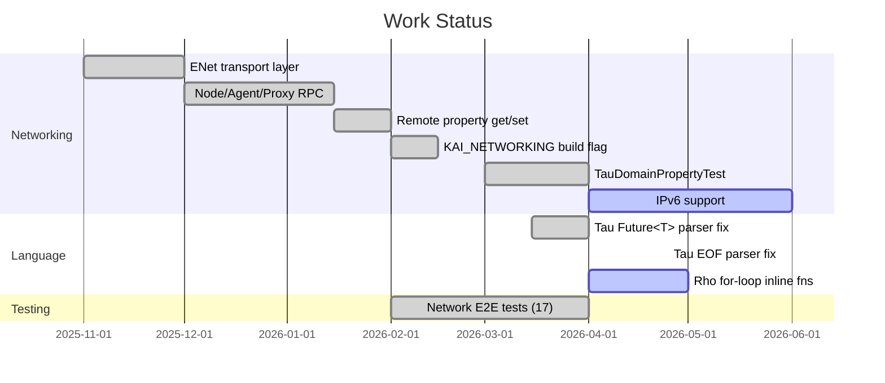

# KAI Project TODO

Last updated: 2026-09-13

## Current Status

## Networking — Done

- [x] Replace RakNet with ENet transport layer
- [x] `Node`/`Domain`/`Agent`/`Proxy` RPC pattern over UDP
- [x] `BinaryStream`-based `Send()` with `SendReliability`/`SendRouting` enums
- [x] `BufferOffset` type replacing bare `int` channel argument
- [x] `FetchProperty<T>` / `StoreProperty<T>` — remote property get/set
- [x] `BroadcastEvent` with optional payload
- [x] `SendObject` — broadcast KAI objects to connected peers
- [x] `ID_KAI_PROPERTY_GET` / `ID_KAI_PROPERTY_SET` message IDs
- [x] `KAI_NETWORKING` CMake option — controls ENet, Network lib, Tau libraries, tests
- [x] `./Scripts/b --network` build script flag
- [x] Tau code generation available through library APIs
- [x] 17 network end-to-end tests all passing
- [x] `TauDomainPropertyTest` — Domain A agent / Domain B proxy / property fetch+set

## Networking — Still Needed

- [ ] IPv6 support (currently IPv4 only)
- [ ] TLS / authenticated connections (plaintext today)
- [ ] Peer discovery on LAN (mDNS or broadcast)
- [ ] Rate limiting / back-pressure on incoming packets
- [ ] Connection heartbeat / automatic reconnect
- [ ] Streaming large objects (currently limited by single-packet size)

## Language

### Tau
- [x] `Future<T>` return types in IDL interfaces (lexer fix — `Future<int>` is one token)
- [x] EOF-safe `Expect()` handling in shared parser utilities (fixed Tau `Next token index out of range` failures)
- [x] Inline module parser test aligned with actual AST shape (`root -> Module -> children`)
- [x] `GenerateProxy` / `GenerateAgent` produce correct class names
- [ ] Struct fields serialized over network (currently structs are code-gen only)
- [ ] Event parameters deserialized in generated agent handlers
- [ ] `async` modifier properly reflected in generated code

### Rho
- [ ] Inline function calls inside `for x in container` loops (currently return 0)
  - `fun double(x) { x * 2 }` works; `for x in arr { sum = sum + double(x) }` does not
  - Root cause: Call nodes in ForEach body don't dispatch correctly
- [ ] `continue` in `foreach` (Mixed_ContinueInForEach still failing)
- [ ] Nested break/continue in C-style for loops
- [x] Python-style `for x in container` syntax
- [x] `break` and `continue` keywords
- [x] `foreach` keyword in Pi
- [x] Array/map indexing with `at`
- [x] Pi keyword validation (rejects `max`, `min`, `swap` etc. as Rho variable names)

### Pi
- [ ] `+!` stack operation
- [ ] `begin`/`until` operations
- [ ] `sin`, `cos`, `pow`, `sqrt`, `abs` math operations
- [ ] `at`, `slice`, `toint`, `tofloat` string operations
- [ ] Code block `{ ... }` translation to continuations (PiControlFlowTests)

## Core System

- [x] `TestPiAdvancedContinuations.TestConditionalContinuation` and
      `TestPiAdvancedControlFlow.TestContinuationConditional` were failing
      with a `TypeMismatch` exception thrown from inside
      `ExecuteContinuationInline` (`ExecutorPerform.cpp`) when a block
      containing a named-function call (e.g. `{ add10 & }`) was executed
      inline via `Operation::If`/`IfElse`. Root cause: the loop's
      `if (continuation_ != cont)` check used `Object::operator!=`, a deep
      value comparison, not an identity check — comparing two genuinely
      different continuations walked their code arrays element-wise and
      threw when two elements at the same index disagreed on type (e.g.
      `Pathname` vs `int`). Fixed 2026-09-13 by replacing it with an
      explicit `continuation_.GetHandle() != cont.GetHandle()` identity
      check. Verified: both tests pass, and the full `TestPi` suite (519
      tests) is green.
- [x] `PiAdvancedTests.ExtremeRecursiveSum` segfault — fixed by the
      `/STACK:16777216` linker flag added to the test/console targets.
- [ ] Fix garbage collection cycles (Registry.cpp — current HACK avoids cycles)
- [ ] Complete pathname resolution (Pathname.cpp)
- [ ] Map serialization with BinaryStream (requires Registry reference)
- [ ] Type traits for custom/reflected types (TestReflection.cpp)

## Build System

- [ ] Clean up duplicate library inclusions in CMake
- [ ] Resolve clang-tidy warnings in ImGui
- [x] Ignore generated bracket-indexed CTest files such as `TestTau[1]_tests.cmake`

## GUI / Window

- [ ] Fix GLFW cursor types (ResizeAll, ResizeNESW, ResizeNWSE missing)
- [ ] Display stack items from bottom up (ExecutorWindow.h)

## Code Cleanup

### Empty/stub files to implement or remove
- `Test/Source/TestStringStream.cpp`
- `Test/Source/TestDebugTrace.cpp`
- `Include/KAI/Core/Thread/*.h` — thread headers are stubs
- `Include/KAI/Core/Method.cpp0x.h` — C++0x artifact

## Diagnostics

- [ ] The `TypeMismatch`/`operator!=` investigation above is resolved — turn
      `KAI_ENABLE_TRACE` back OFF (`cmake .. -DKAI_ENABLE_TRACE=OFF`) if it's
      still on from debugging; it writes verbose `KAI_TRACE()` output to
      `Logs/kai.log` and slows every run.

## Notes

- Total TODO/FIXME/HACK comments in codebase: ~76
- Shell (backtick) syntax disabled by default; enable with `-DENABLE_SHELL_SYNTAX=ON`
  (or `py build.py --enable-shell` on Windows)
- Networking is built by default (`KAI_NETWORKING=ON`); pass `-DKAI_NETWORKING=OFF` to skip it
- Full suite passes with networking-enabled build; some network tests are still environment-skipped when local sockets are unavailable
