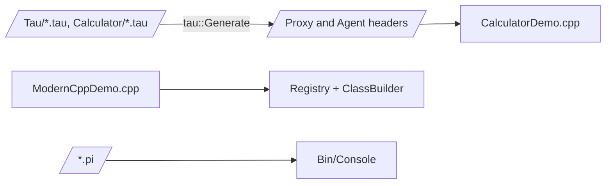

# Examples

Example code for KAI. These are reference material: `Examples/CMakeLists.txt` defines `ModernCppDemo`, but the folder is not added to the root build, so nothing here is built by default.

| Example | What it shows |
|---------|---------------|
| `ModernCppDemo.cpp` | Exposing C++ classes and methods to the runtime through reflection, linking `Core`, `Executor` and `CommonLang` |
| [Tau/](Tau/README.md) | Tau interfaces for a calculator, a chat service, a game server and a file service |
| `Calculator/` | A Tau calculator with checked-in generated `.agent.h` and `.proxy.h`, and `CalculatorDemo.cpp`. The generated headers predate the move from RakNet to ENet and need regenerating before use |
| `foreach_examples.pi`, `test_foreach.pi` | `foreach` in Pi |



## Running scripts

```bash
./Bin/Console foreach_examples.pi
./Bin/Console -l rho script.rho
./Bin/Console program.sigma
```

## More examples

The test script folders are the largest collection of working programs:

- `Test/Language/TestPi/Scripts/`: Pi
- `Test/Language/TestRho/Scripts/`: Rho
- `Test/Language/TestSigma/Scripts/`: Sigma (115 programs, each type-checked and run)
- `Test/Language/TestTau/Scripts/`: Tau
- `Demo/ContinuationMobilityDemo/ContinuationMobilityDemo.rho`: continuation migration

## See Also

- [Pi Tutorial](../Doc/PiTutorial.md), [Rho Tutorial](../Doc/RhoTutorial.md), [Sigma](../Doc/Sigma/README.md), [Tau Tutorial](../Doc/TauTutorial.md)
- [Console](../Source/App/Console/README.md)
