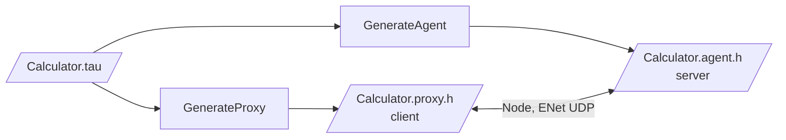

# Tau IDL Examples

Practical Tau interface definitions showing the language's features and common patterns for distributed services. These are inputs for the Tau generator; they are not built.

## Examples Overview

### 1. Calculator.tau - Basic Service Example
**Demonstrates:**
- Simple method definitions with parameters and return types
- Basic event declarations
- Clear namespace organization

**Use Case:** Mathematical operations service with event notifications

**Key Features:**
- Float arithmetic operations
- Event-driven notifications for completed calculations
- Simple method signatures

### 2. ChatService.tau - Messaging System Example
**Demonstrates:**
- Complex data structures (User, Message)
- Array return types and parameters
- Multiple related interfaces
- Real-time event patterns

**Use Case:** Complete chat/messaging service backend

**Key Features:**
- User management and authentication
- Channel-based messaging
- Real-time message events
- Array handling for user lists and message history

### 3. GameServer.tau - Multiplayer Gaming Example
**Demonstrates:**
- Nested namespaces (`Gaming::Multiplayer`)
- Interface inheritance (`IMatchService : IGameService`)
- Complex nested structures (Vector3, Transform, Player)
- Game state management

**Use Case:** Multiplayer game server with match-based gameplay

**Key Features:**
- 3D position and transform handling
- Player state management
- Match lifecycle management
- Real-time player action events

### 4. FileService.tau - Distributed File System Example
**Demonstrates:**
- Enumeration definitions (`FilePermission`)
- Binary data handling with `int[]` arrays
- Optional parameters with defaults
- Complex upload/download workflows
- Permission system modeling

**Use Case:** Distributed file storage and management service

**Key Features:**
- File and directory operations
- Chunked upload/download with progress tracking
- Permission management system
- File system monitoring events

## Usage Examples

### Generating code from an example

The old `NetworkGenerate` tool has been removed; generation is a library call. Each generator takes the Tau source text and writes C++ into a string:

```cpp
#include <KAI/Language/Tau/Generate/GenerateProxy.h>
#include <KAI/Language/Tau/Generate/GenerateAgent.h>

std::string source = ReadFile("Examples/Tau/Calculator.tau");

std::string proxyCode, agentCode;
tau::Generate::GenerateProxy proxy(source.c_str(), proxyCode);
tau::Generate::GenerateAgent agent(source.c_str(), agentCode);

if (proxy.failed) std::cerr << proxy.error;
WriteFile("Calculator.proxy.h", proxyCode);
WriteFile("Calculator.agent.h", agentCode);
```



### Using an example in a project

1. Pick the example closest to your use case
2. Change the interfaces to fit
3. Generate the Proxy and Agent with the library calls above, as a build step or tool
4. Implement the servant behind the Agent
5. Call it through the Proxy; every call returns a `Future<T>`

## Feature Reference

| Feature | Calculator | ChatService | GameServer | FileService |
|---------|------------|-------------|------------|-------------|
| Basic Methods | ✅ | ✅ | ✅ | ✅ |
| Events | ✅ | ✅ | ✅ | ✅ |
| Structs | ❌ | ✅ | ✅ | ✅ |
| Arrays | ❌ | ✅ | ✅ | ✅ |
| Enums | ❌ | ❌ | ❌ | ✅ |
| Inheritance | ❌ | ❌ | ✅ | ❌ |
| Nested Namespaces | ❌ | ❌ | ✅ | ❌ |
| Default Parameters | ❌ | ✅ | ❌ | ✅ |
| Binary Data | ❌ | ❌ | ❌ | ✅ |

## Best Practices Demonstrated

### 1. Namespace Organization
- Use meaningful namespace names that reflect your domain
- Consider nested namespaces for large systems (`Gaming::Multiplayer`)
- Keep related interfaces in the same namespace

### 2. Data Structure Design
- Define reusable structures for common data types
- Use clear, descriptive field names
- Consider future extensibility when designing structures

### 3. Method Signatures
- Use descriptive method names that clearly indicate purpose
- Provide default values for optional parameters where appropriate
- Consider return types carefully (void vs. status codes vs. data)

### 4. Event Design
- Use events for notifications and real-time updates
- Include relevant data in event parameters
- Consider event frequency and network impact

### 5. Array Handling
- Use arrays for collections of data
- Consider maximum sizes for large data sets
- Provide count/limit parameters for pagination

## Testing Generated Code

After generating code from these examples, you can test with the KAI test suite:

```bash
# Run Tau tests to verify generation works
./Bin/Test/TestTau

# Test specific generation features
./Bin/Test/TestTau --gtest_filter="*CodeGeneration*"
```

## Further Development

These examples serve as starting points for your own Tau interfaces. Consider:

1. **Extending existing examples** with additional methods or events
2. **Combining patterns** from multiple examples in your own interfaces
3. **Adding error handling** patterns specific to your domain
4. **Implementing authentication** and authorization patterns
5. **Adding rate limiting** and throttling considerations

## See Also

- **[Tau Tutorial](../../Doc/TauTutorial.md)** - Complete language reference
- **[Tau headers](../../Include/KAI/Language/Tau/README.md)** - Generator API
- **[Tau Code Generation Guide](../../Doc/TauCodeGeneration.md)** - Architecture details
- **[Test Examples](../../Test/Language/TestTau/)** - Additional test cases