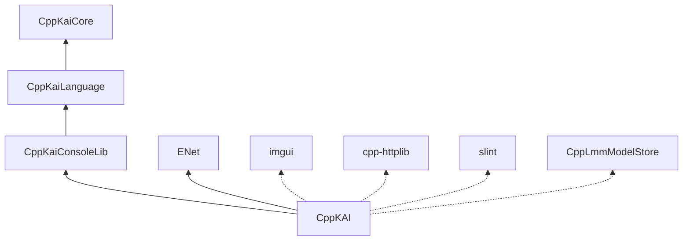

# Externals

Git submodules and vendored libraries. Initialise them with `git submodule update --init --recursive`.

## KAI submodules

| Submodule | Contents |
|-----------|----------|
| [CppKaiCore](CppKaiCore) | Core object model, Registry, tri-colour GC, Executor, `Language/Common` |
| [CppKaiLanguage](CppKaiLanguage) | Pi and Rho |
| [CppKaiConsoleLib](CppKaiConsoleLib) | The Console library, with the `AddTranslator` and `AddSendCheck` hooks |
| [CppLmmModelStore](CppLmmModelStore) | Local model store for the optional LLM features; models under `~/.cache/deepseek/models` by default |

## Third party

| Library | Use |
|---------|-----|
| ENet | UDP transport for networking. Not modified here: fixes belong in CppKAI, not in the submodule |
| imgui | Dear ImGui, for the Window app |
| cpp-httplib | HTTP client for the Window app's assistant pane |
| slint | Slint UI, for the in-progress Slint front end |
| rang | Cross-platform console colouring |
| make-graph | Build-graph helper |

Dotted dependencies are optional, behind `KAI_BUILD_IMGUI`, `KAI_BUILD_SLINT` and `KAI_BUILD_LLM`.
