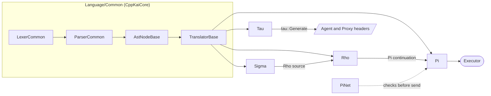

# Language

Headers for the KAI languages that live in CppKAI. Every language is its own static library, and all of them are built on the shared lexer, parser, AST and translator framework in `KAI/Language/Common` (from the CppKaiCore submodule).

| Language | Headers | Library | Status |
|----------|---------|---------|--------|
| **Pi** (π) | `Ext/CppKaiLanguage/Include/KAI/Language/Pi` | `PiLang` | Bedrock RPN language, runs on the Executor |
| **Rho** (ρ) | `Ext/CppKaiLanguage/Include/KAI/Language/Rho` | `RhoLang` | Infix, Python-like, compiles to Pi |
| **Sigma** (σ) | [`Sigma/`](Sigma) | `SigmaLang` | Rho's syntax plus static types, compiles to Rho |
| **PiNet** | [`PiNet/`](PiNet) | `PiNetLang` | Transport check for continuations sent between nodes |
| **Tau** | [`Tau/`](Tau) | `TauLang` | IDL that generates network Agents and Proxies (needs `KAI_NETWORKING`) |
| **Lisp** | [`Lisp/`](Lisp) | not built | Scaffold copied from Rho |
| **Hlsl** | [`Hlsl/`](Hlsl) | not built | Experimental HLSL front end |

## Pi

Postfix, with two stacks: one for data and one for context. Inspired by Forth. The data stack plus the instruction pointer are the whole continuation state, which is what makes continuations transportable.

## Rho

Infix and indentation-based, like Python. Translated to Pi.

## Sigma

Rho's syntax plus static types. Every program is type-checked, then translated to Rho. See the [Sigma reference](../../../Doc/Sigma/README.md).

## PiNet

A continuation that travels may only use names it binds itself. PiNet enforces that before `send`, and is registered by the Console app through `Console::AddSendCheck`. See [PiNet](../../../Doc/PiNet.md).

## Tau

An interface definition language used to generate network Agents and Proxies. It is not executable. See [Tau](Tau/README.md).

## See Also

- [Pi Tutorial](../../../Doc/PiTutorial.md)
- [Rho Tutorial](../../../Doc/RhoTutorial.md)
- [Sigma Reference](../../../Doc/Sigma/README.md)
- [PiNet](../../../Doc/PiNet.md)
- [Tau Tutorial](../../../Doc/TauTutorial.md)
- [Language Guide](../../../Doc/LanguageGuide.md)
- [Common Language System](../../../Doc/CommonLanguageSystem.md)
- [Console Integration](../../../Source/App/Console/README.md)
- [Language System Architecture](../../../resources/diagrams/language-system-architecture.md)
