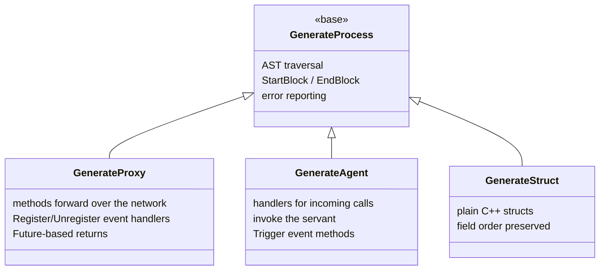
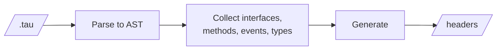

# Tau Code Generation

Headers for the generators that turn a Tau AST into C++.



| Header | Produces |
|--------|----------|
| `GenerateProcess.h` | Base class: AST walking, output formatting, errors |
| `GenerateProxy.h` | `<Name>Proxy`: serialises arguments into a `BinaryStream`, returns `Future<T>`, and adds `Register<Event>Handler` / `Unregister<Event>Handler` for each event |
| `GenerateAgent.h` | `<Name>Agent`: deserialises arguments, calls the servant, serialises non-void results, and adds `Trigger<Event>` for each event |
| `GenerateStruct.h` | Plain structs for data transfer, including nested structs |

## Stages



## Example

```tau
namespace ChatApp {
    interface IChatService {
        void SendMessage(string user, string message);
        string[] GetRecentMessages(int count = 10);

        event MessageReceived(string user, string message, string timestamp);
    }
}
```

produces

- `ChatApp::IChatServiceProxy` with `SendMessage`, `GetRecentMessages`, and `RegisterMessageReceivedHandler(std::function<void(string, string, string)>)`
- `ChatApp::IChatServiceAgent` with handlers for both methods and `TriggerMessageReceived`

The generator is a library; the old `NetworkGenerate` executable is no longer built.

## See Also

- [Generator sources](../../../../../Source/Library/Language/Tau/Source/Generate)
- [Tau Tutorial](../../../../../Doc/TauTutorial.md)
- [Tau Code Generation](../../../../../Doc/TauCodeGeneration.md)
- [Code generation tests](../../../../../Test/Language/TestTau)
