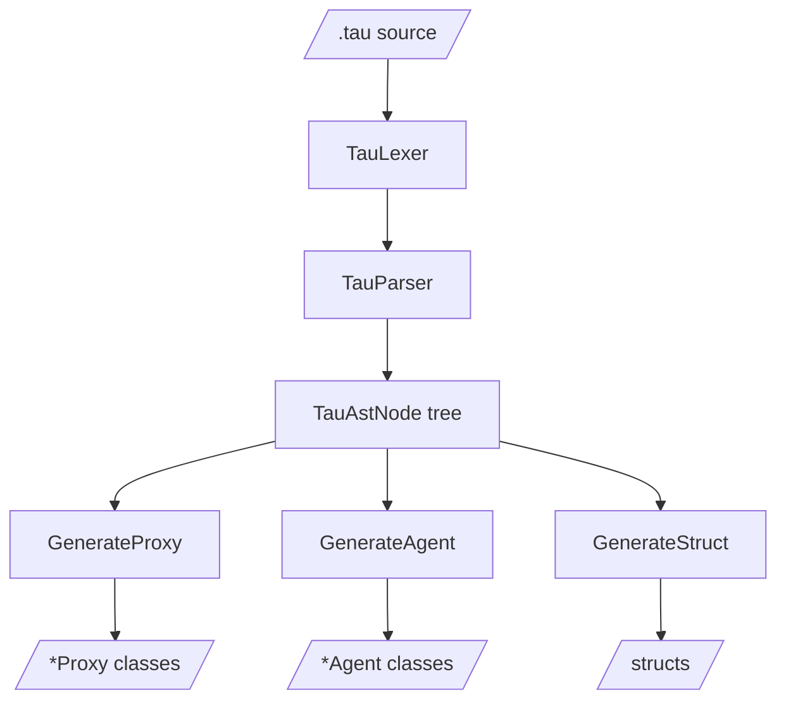
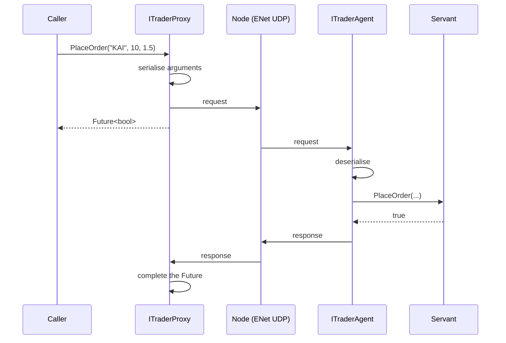

# Tau

Tau is KAI's Interface Definition Language for networked objects. It is the one KAI language that is **not executable**: it describes the shape of a network interface, and the generator turns that description into C++.

Tau uses the same `Language/Common` lexer and parser framework as Pi, Rho and Sigma. The input is a `.tau` file; the output is:

1. **Proxies** (`<Name>Proxy`): local stand-ins that forward calls to a remote agent and return `Future<T>`
2. **Agents** (`<Name>Agent`): endpoints that receive calls and invoke the real implementation
3. **Structs**: plain C++ data types shared by both ends



## Example

```tau
namespace Trading {
    interface ITrader {
        bool PlaceOrder(string symbol, int quantity, float price);
        void CancelOrder(string orderId);

        event OrderPlaced(string symbol, int quantity, float price);
    }
}
```

Supported: `namespace` (including nested `A::B::C`), `interface` with inheritance, methods, properties, `event`, `struct` and `enum`. The full grammar is in the [Tau Formal Definition](../../../../Doc/TauFormalDefinition.md).

## A call through a Proxy



Agents and Proxies are created through a `Domain` (`Include/KAI/Network/Domain.h`): `MakeAgent<T>()` on the hosting node, `MakeProxy<T>(NetHandle)` everywhere else.

## Usage

Call the generator library (`tau::Generate::*`) from an application or build step. The old `NetworkGenerate` command-line tool is no longer built. Tau is only built with `KAI_NETWORKING=ON` and not for Android.

- Headers: [`Generate/`](Generate/README.md)
- Sources: [`Source/Library/Language/Tau/Source`](../../../../Source/Library/Language/Tau/Source/README.md)
- Tests: [`Test/Language/TestTau`](../../../../Test/Language/TestTau/README.md)
- Examples: [`Examples/Tau`](../../../../Examples/Tau/README.md)

## See Also

- [Tau Tutorial](../../../../Doc/TauTutorial.md)
- [Tau Code Generation](../../../../Doc/TauCodeGeneration.md)
- [Tau Architecture Diagrams](../../../../Doc/TauArchitectureDiagrams.md)
- [Network Tau Interfaces](../../../../Doc/NetworkTauInterfaces.md)
