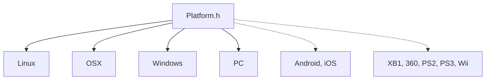

# Platform

Platform-specific headers. `Platform.h` is the abstraction layer and `GameController.h` the controller interface; each subdirectory holds what one platform needs.

| Directory | Contents | Status |
|-----------|----------|--------|
| `Linux/` | `ConsoleColor.h` | Active (Ubuntu, Debian, CentOS, WSL2) |
| `OSX/` | `ConsoleColors.h` | Active |
| `Windows/` | Version folders `9/`, `10/`, `XP/` | Active on Windows 10/11; version folders are placeholders |
| `PC/` | `GameController.h`, `Network/TcpClientImpl.h` | Legacy PC implementations |
| `Android/` | | Placeholder; the Android build is in [`/Android`](../../../Android/README.md) |
| `iOS/` | | Placeholder |
| `XB1/`, `360/`, `PS2/`, `PS3/`, `Wii/` | | Placeholders from KAI's console-game era, no code |

Sources for platform libraries are in [`Source/Library/Platform`](../../../Source/Library/Platform/README.md).
