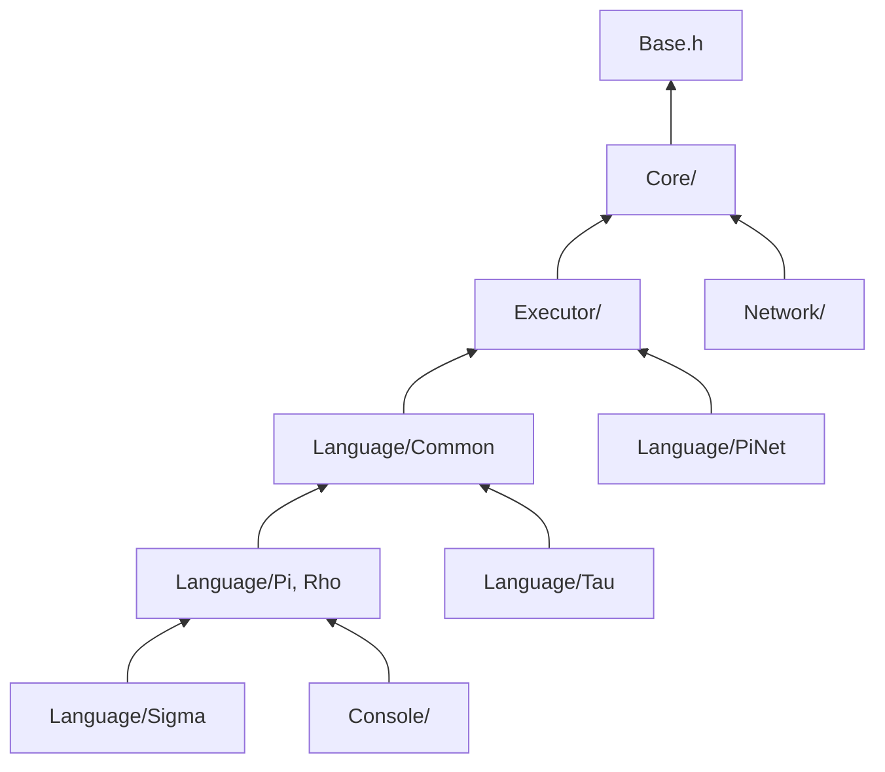

# KAI Headers

Headers under `Include/KAI` in this repo, plus pointers to the ones that live in the submodules. All of them are included as `<KAI/...>`.

## In this repo

### Language.h
Forwards to `KAI/Language/Language.h` (the `Language` enumeration for Pi, Rho, Sigma, Tau and the experimental languages).

### [Language/](Language/README.md)
- **Sigma/**: `SigmaLexer`, `SigmaParser`, `SigmaChecker`, `SigmaTranslator`
- **PiNet/**: `PiNet.h`, the transport check registered with `Console::AddSendCheck`
- **Tau/**: `TauLexer`, `TauParser`, `TauAstNode`, and the [generators](Language/Tau/Generate/README.md)
- **Lisp/**, **Hlsl/**: experimental, not built

### Network/
- **Node.h**: one peer; `Listen`, `Connect`, `Step`
- **Domain.h**: groups a `Node` with `MakeAgent<T>()` and `MakeProxy<T>(NetHandle)`
- **Agent.h**, **Proxy.h**: the two ends of a remote call
- **Future.h**: shared-state `Future<T>`, nestable
- **NetHandle.h**: an object's handle within a Domain
- **Transport.h**, **ConnectionManager.h**, **PeerDiscovery.h**: transport and connections
- **Serialization.h**: wire format

### LLM/
Optional, built with `KAI_BUILD_LLM=ON`:
- **ModelCache.h**: resolve and create model cache directories
- **Session.h**: load a model and route prompts through an injected backend
- **RepoIndexer.h**: build a local code and test knowledge base
- **RhoDataset.h**: build a JSONL training set from scripts, tests and docs

### [Platform/](Platform/README.md)
Platform-specific headers.

### Ext/
Vendored header-only libraries (`Rang`).

## From the submodules

| Headers | Submodule |
|---------|-----------|
| `KAI/KAI.h`, `KAI/Base.h`, `KAI/ClassBuilder.h` | CppKaiCore |
| `KAI/Core/`: `Object`, `Registry`, `Tree`, `Type`, `BinaryStream`, `ObjectColor`, `Memory/` | CppKaiCore |
| `KAI/Executor/`: `Executor`, `Continuation`, `Operation` | CppKaiCore |
| `KAI/Language/Common/`: `LexerCommon`, `ParserCommon`, `TranslatorBase` | CppKaiCore |
| `KAI/Language/Pi/`, `KAI/Language/Rho/` | CppKaiLanguage |
| `KAI/Console/Console.h` | CppKaiConsoleLib |



## Usage

```cpp
#include <KAI/KAI.h>
using namespace kai;

Registry reg;
// MyClass must first be registered with ClassBuilder
Object obj = reg.New<MyClass>();
```

```cpp
#include <KAI/Console/Console.h>

kai::Console console;
console.Run();
```

```cpp
#include <KAI/Network/Node.h>
using namespace kai::net;

Node node;
node.Connect(IpAddress("127.0.0.1"), 14600);
node.Step();
```

## Threading

Most KAI objects are not thread-safe. KAI's model for parallelism is several Registries that communicate through Tau, Rho and Pi, not threads sharing one Registry. If you do use threads, give each its own Registry.

## See Also

- [Architecture](../../Doc/Architecture.md)
- [Common Language System](../../Doc/CommonLanguageSystem.md)
- [Network Architecture](../../Doc/NetworkArchitecture.md)
- [Build](../../Doc/BUILD.md)
