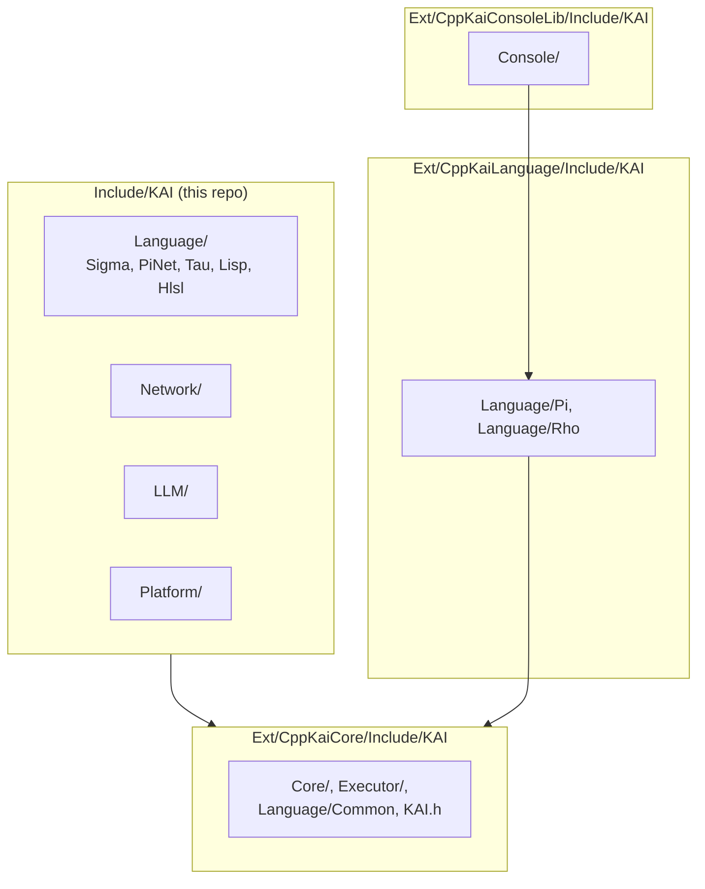

# Include

Public headers built in CppKAI. Most of KAI's headers come from the submodules, which add their own `Include` directories to the path, so `#include <KAI/...>` works the same either way.

| Area | Where | What |
|------|-------|------|
| Core | `Ext/CppKaiCore` | Objects, Registry, Tree, types, reflection, tri-colour GC |
| Executor | `Ext/CppKaiCore` | Two-stack virtual machine (data and context), inspired by Forth |
| Pi, Rho | `Ext/CppKaiLanguage` | Postfix and infix languages |
| Console | `Ext/CppKaiConsoleLib` | Cross-platform REPL for Pi, Rho and Sigma; switch language on the fly |
| Sigma, PiNet, Tau | [`KAI/Language`](KAI/Language/README.md) | Typed language, send check, IDL |
| Network | `KAI/Network` | Node, Domain, Agent, Proxy, `Future<T>`. Independent of transport; ENet is the current implementation |
| LLM | `KAI/LLM` | Model cache, session, repo indexer, dataset builder |
| Platform | [`KAI/Platform`](KAI/Platform/README.md) | Platform-specific headers |

`kai_compat.h` and `rang.hpp` (terminal colours) are also here.

See [KAI/README.md](KAI/README.md) for the header-level tour.
