# KAI 

[](https://www.codefactor.io/repository/github/cschladetsch/cppkai)
[](./LICENSE)

KAI is a network-distributed object model for C++ with full runtime reflection, persistence and incremental garbage collection, and a family of languages that all compile down to one execution model. No macros are needed to expose fields or methods to the runtime, including types from other libraries.

Everything runs on an **Executor**. Higher-level languages are translated, layer by layer, into **Pi**, the stack-based bedrock language. Objects live in a **Registry**; nodes that share object handles form a **Domain**; and a running continuation can be frozen on one node, sent to another, and resumed there.

There is no global state in the design and no central server: KAI is peer to peer.

## Contents

- [Overview](#overview)
- [Sigma](#sigma)
- [Tau](#tau)
- [Rho](#rho)
- [Pi](#pi)
- [Domain](#domain)
- [Object Model](#object-model)
- [Console](#console)
- [Building](#building)
- [Repository Layout](#repository-layout)
- [Documentation](#documentation)

---

## Overview

KAI has four languages with a deliberate division of labour. Three are executable; one is an interface definition language.

| Language | Prompt | Kind | Role |
|----------|--------|------|------|
| **Sigma** | `σ` | Executable, statically typed | Rho's syntax plus static types; type-checked, then compiled to Rho |
| **Rho** | `ρ` | Executable, infix | Python-like scripting; compiled to Pi |
| **Pi** | `π` | Executable, RPN | The execution substrate; runs directly on the Executor |
| **Tau** | | Not executable, IDL | Describes network interfaces; generates C++ Agent and Proxy pairs |

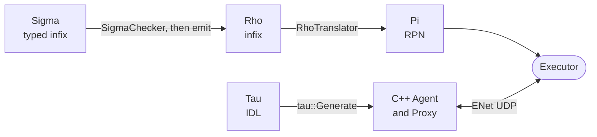

The bedrock is four things: **Pi**, **Continuation**, **Executor** and **Tau**. Everything else is built on them.

### Demo

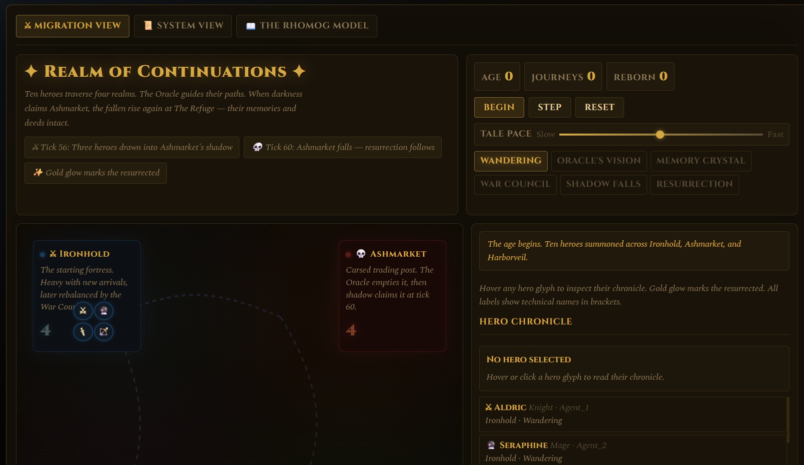

**[Live Interactive Demo](https://cschladetsch.github.io/CppKAI/Demo/ContinuationMobilityDemo/)**

An animated walk-through of agent migration, Pi-guided routing, load balancing and snapshot-based recovery after a simulated host failure. It has three layers: the interactive RhoMog visualisation explains the idea, `./Bin/ContinuationMobilityDemo` runs the deterministic executable model, and `./Scripts/network/run_continuation_migration_demo.sh` proves the runtime path by freezing a stateful Pi workflow in one process, sending it to another, thawing it, resuming it, and returning `42`.

---

## Sigma

Sigma is the typed layer: Rho's syntax plus static types. Every program is type-checked before it runs, so a Sigma program with a type error never runs.

```sigma
fun gcd(a: int, b: int) -> int
    return b == 0 ? a : gcd(b, a % b)

g = gcd(48, 18)       // g: int, inferred
g = "six"             // 5:5: cannot assign to 'g': expected int, got str
```

- Built on the `Language/Common` framework (`LexerCommon`, `ParserCommon`, `AstNodeBase`, `TranslatorBase`)
- Lives in `Source/Library/Language/Sigma` and `Include/KAI/Language/Sigma`, built as `SigmaLang`
- Registered by the Console app through `Console::AddTranslator`, so CppKaiCore and CppKaiConsoleLib never depend on it

### Continuation operators

A call can end in one of Rho's continuation operators, written directly after the `)` with no space:

| Sigma | Pi | Meaning |
|-------|----|---------|
| `f(x)` | `Suspend` | an ordinary call |
| `f(x)&` | `Suspend` | the same, written out |
| `f(x)!` | `Replace` | a tail call: `f` takes the place of the running function |

With a space the operator means something else: `f(x) & mask` is a bitwise and, and `f(x) !` is a syntax error.

### How Sigma compiles

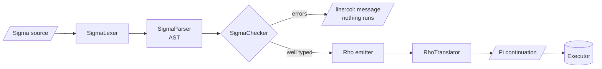

Full reference: **[Doc/Sigma](Doc/Sigma/README.md)**.

---

## Tau

Tau is an IDL for distributed object contracts across process boundaries. It is orthogonal to Pi, Rho and Sigma: it describes the shape of a network interface rather than compiling into them.

```tau
namespace Sensor {
    interface ISensor {
        int Value;
        Future<int> Measure(float range);
    }
}
```

From a `.tau` file the generator library (`tau::Generate`) produces:

- an **Agent** (`*.agent.h`): the endpoint that wraps the real object
- a **Proxy** (`*.proxy.h`): the local stand-in that forwards calls to the agent and returns `Future<T>`

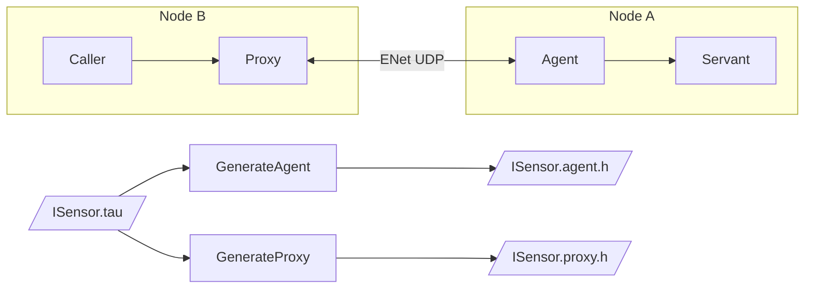

```cpp
// Domain A: host a service
Node nodeA;
nodeA.Listen(IpAddress("127.0.0.1"), 14600);
ISensorAgent agent(nodeA);

// Domain B: call it remotely
Node nodeB;
nodeB.Connect(IpAddress("127.0.0.1"), 14600);
ISensorProxy proxy(nodeB, agent.Handle());
auto future = proxy.Value();          // Future<int>, returns immediately
nodeB.Step();
```

The old `NetworkGenerate` command-line tool has been removed; embed the Tau generator APIs when headers need to be produced as part of a tool or build step. See **[Tau](Include/KAI/Language/Tau/README.md)** and **[Tau Tutorial](Doc/TauTutorial.md)**.

---

## Rho

Rho is the scripting layer: a structured, Python-like, indentation-based infix language that compiles down to Pi. It exists so people do not have to write Pi by hand.

```rho
square = fun(x)
    return x * x

makeMultiplier = fun(factor)
    multiplier = fun(x)
        return x * factor
    return multiplier

triple = makeMultiplier(3)
assert(square(5) == 25)
assert(triple(4) == 12)
```

```rho
let a = 3
let b = 4
let c = a + b
```

compiles to

```pi
3 4 +
// stack: [ 7 ]
```

Rho has no GIL, has native coroutines, and its values are type-safe over the wire. It is duck-typed; Sigma is the statically typed layer on top.

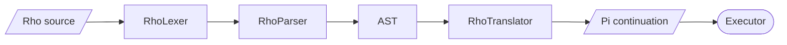

See **[Rho Tutorial](Doc/RhoTutorial.md)**.

---

## Pi

Pi is the execution substrate: a minimal, imperative RPN stack language inspired by Forth. The Executor runs Pi directly. The data stack plus the instruction pointer are the complete continuation state; nothing implicit is held elsewhere. That is what makes it possible to freeze a running computation, send it across the network, and resume it on another Executor with no data loss.

```pi
2 3 +                // 5
{ dup * } 'square #  // store a continuation under the name square
5 square &           // run it: 25
```

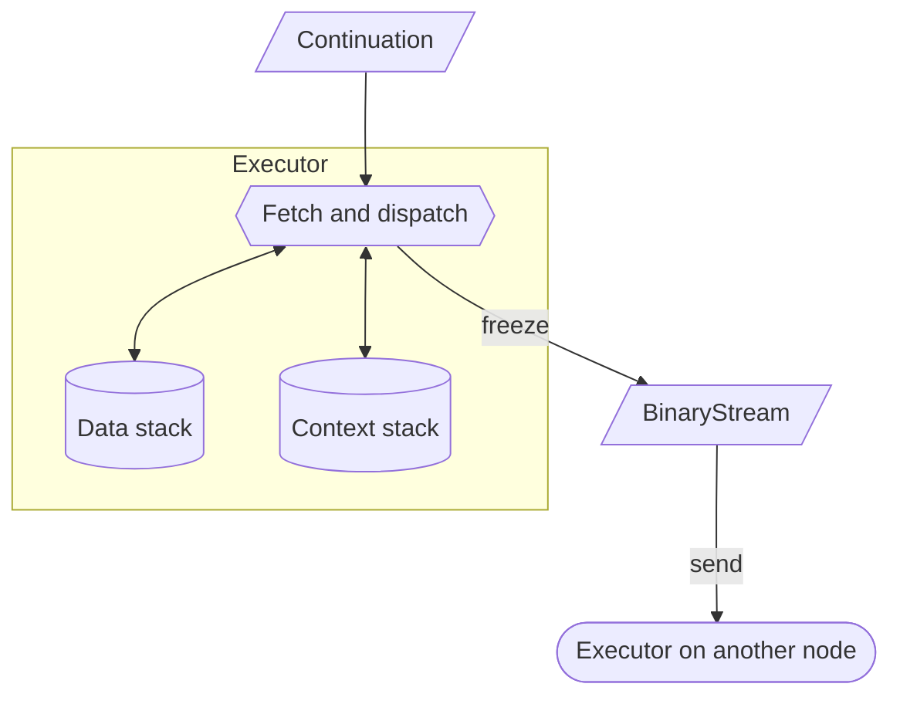

### PiNet

A continuation that travels may only use names it binds itself. `{ 'n # n n * }` can travel; `{ a + }` is refused, because `a` would be looked up on whatever node it lands on. PiNet checks this before `send` does anything, on the sender, and names what is at fault.

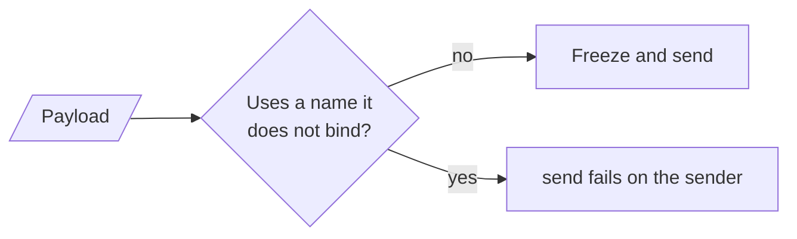

PiNet lives in CppKAI (`PiNetLang`), not CppKaiCore. CppKaiConsoleLib exposes a generic `Console::AddSendCheck` hook and the Console app registers PiNet with it. See **[PiNet](Doc/PiNet.md)** and **[Pi Tutorial](Doc/PiTutorial.md)**.

---

## Domain

A **Domain** is the set of nodes that share object handles. In code (`Include/KAI/Network/Domain.h`) it wraps a `Node` and is the factory for the two ends of a network call:

- `MakeAgent<T>()`: an endpoint that receives calls for a servant on this node
- `MakeProxy<T>(NetHandle)`: a local representative of an agent on this node or another

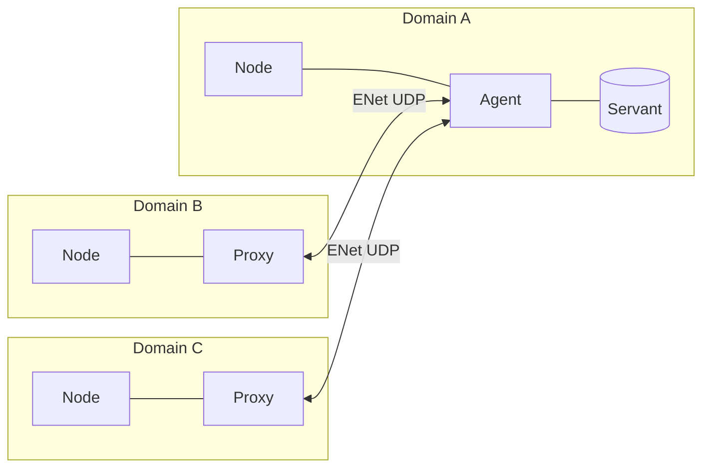

Every node is a peer. There is no central server and no network-wide lock, and parallelism comes from running several Registries that talk to each other rather than threads inside one Registry.

### Continuation migration

Because serialisation is first-class, a running continuation can move between Domains:

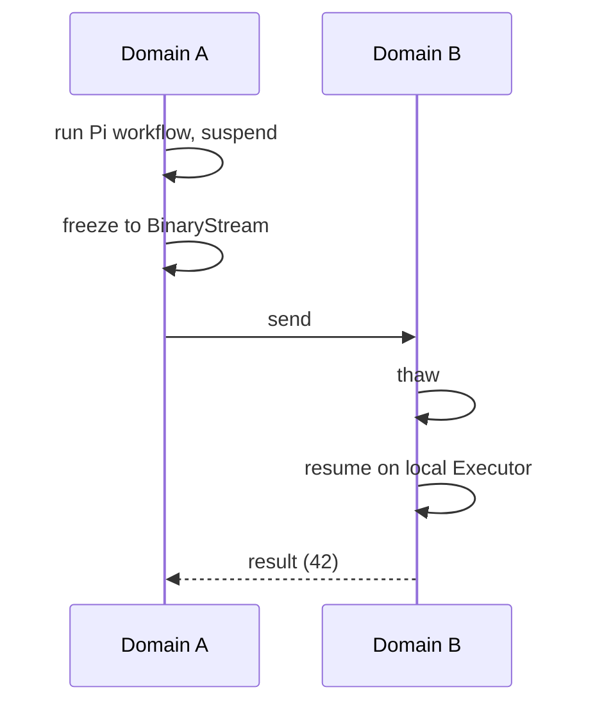

`./Scripts/network/run_continuation_migration_demo.sh` runs exactly this between two processes. From the Console, `send` also runs PiNet first, so a continuation that would break on the far node is refused on the sender.

### Design direction

Not yet in the code: a three-part address (`node:reg:#`) so Executors can migrate without breaking references, and a model for shared state with no single owner, where an object's state is the reconciled centroid of every peer holding an opinion on it, propagated by State Update Packets at a rate set per node pair. Object identity and discovery across the network is the open problem in this layer.

See **[Networking](Doc/Networking.md)**, **[Peer to Peer](Doc/PeerToPeerNetworking.md)** and **[Network Architecture](Doc/NetworkArchitecture.md)**.

---

## Object Model

- **Registry**: type-safe object factory that creates, reflects and owns objects
- **ClassBuilder**: exposes C++ types, fields and methods to the runtime with no macros
- **Executor**: the stack machine that runs Pi
- **Garbage collector**: incremental tri-colour, run by the Registry

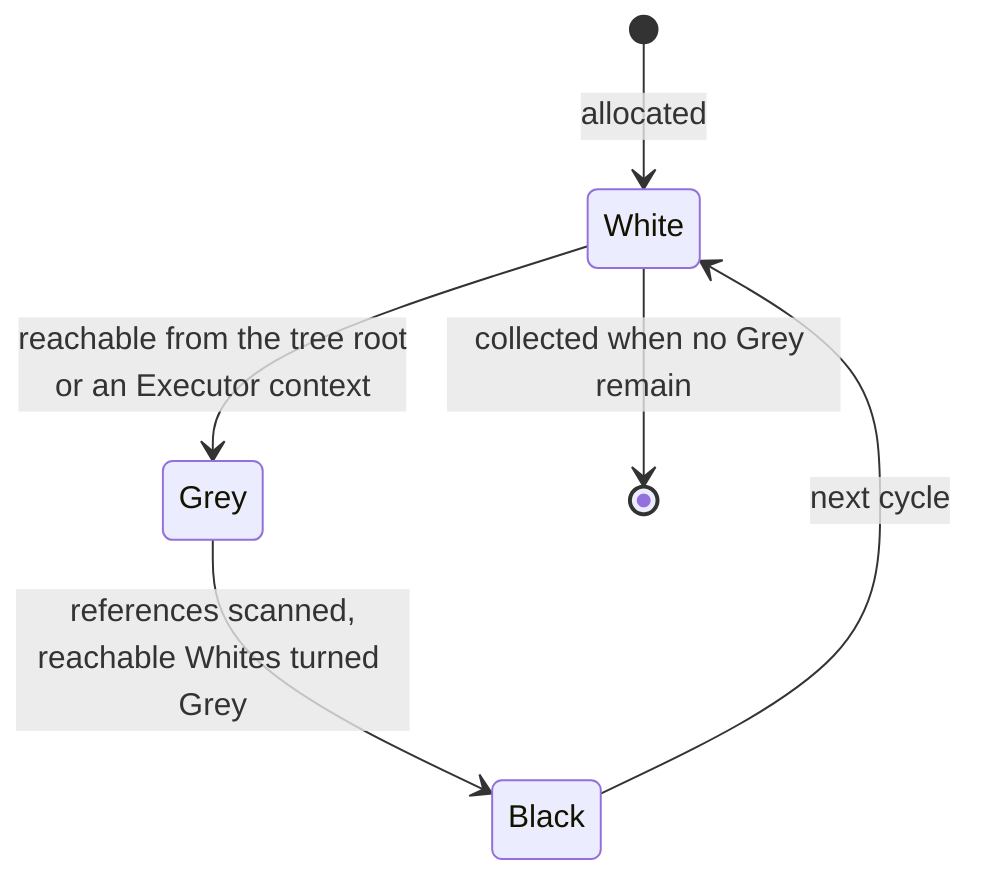

### Nested futures

`Future<T>` wraps a `shared_ptr<State<T>>`, so it nests cleanly: resolving a `Future<Future<T>>` delivers the inner future, which may still be pending, and resolving that later is visible through any copy already unwrapped.

```cpp
using namespace kai::net;

Future<int> inner;
Future<Future<int>> outer;

outer.SetValue(inner);
outer.SetResponse(ResponseType::Returned);
outer.SetComplete(true);

Future<int> unwrapped = outer.GetValue();
assert(!unwrapped.IsComplete());

inner.SetValue(42);
inner.SetResponse(ResponseType::Returned);
inner.SetComplete(true);

assert(unwrapped.GetValue() == 42);
```

Covered by `Test/Network/NestedFutureTest.cpp`, `NestedFutureParamTests.cpp` and `NestedFutureTripleTest.cpp`. Nested futures as arguments across a network RPC have not been verified.

---

## Console

```bash
./Console                    # interactive Pi (default)
./Console -l rho             # interactive Rho
./Console script.pi          # run a Pi script
./Console -t 2 script.rho    # run with trace level 2
```

```
π 2 3 +
[0]: 5

π rho
Switched to Rho language mode

ρ x = 42; y = x * 2; y
[0]: 84
```

- The prompt shows only the active language symbol (`π`, `ρ`, `σ`, `$`)
- The whole data stack is printed after each command, top first, with `[0]` on the bottom line
- History persists in `~/.kai_history`; command numbers are available through `history` and `!n`
- Shell backticks are **off by default** (`-DENABLE_SHELL_SYNTAX=ON` to enable; native Windows then routes commands through WSL2's bash)

### Console networking

```bash
# Console 1
π /network start 14600
π 2 3 +

# Console 2
π /network start 14601
π /connect localhost 14600
π /@0 10 *              # run on peer 0
π /broadcast stack      # run on every peer
```

| Command | Effect |
|---------|--------|
| `/network start [port]` | Enable networking |
| `/connect <host> <port>` | Connect to a peer |
| `/@<peer> <command>` | Run a command on one peer |
| `/broadcast <command>` | Run a command on all peers |
| `/peers` | List connected peers |

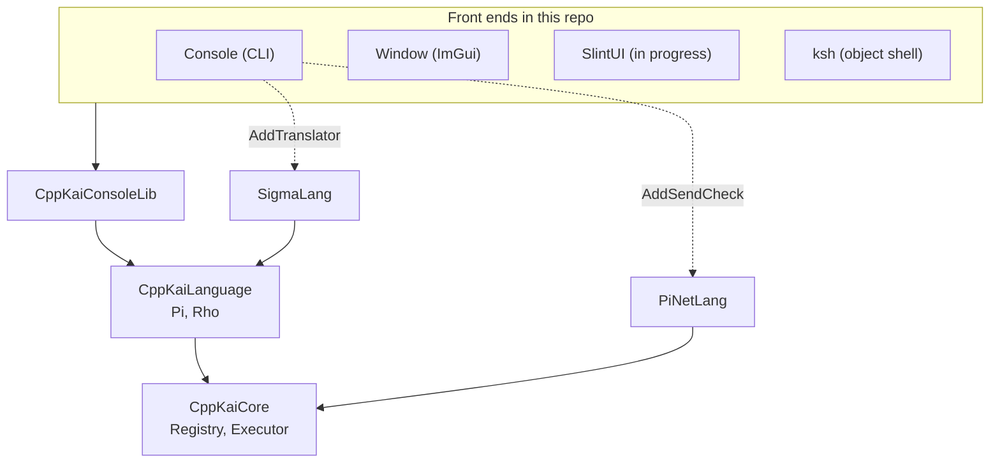

See **[Console Networking](Doc/CONSOLE_NETWORKING.md)**.

---

## Building

### Prerequisites

- C++23 compiler: Clang 16+ (default), GCC 13+, or MSVC 19.5+ (VS 2022/2026)
- CMake 3.28+
- Ninja
- Python 3.10+ (Windows build scripts)

### Linux / WSL2 / macOS

```bash
git clone https://github.com/cschladetsch/CppKAI.git
cd CppKAI
git submodule update --init --recursive

./Scripts/build.sh                     # quick Debug build (Clang, Ninja)

# or plain CMake
cmake -S . -B build -G Ninja
cmake --build build
ctest --test-dir build
```

### Windows

```powershell
git clone https://github.com/cschladetsch/CppKAI.git
cd CppKAI
git submodule update --init --recursive

py build.py                     # Release, Clang + Ninja
py build.py --config Debug
py build.py --msvc              # MSVC + Visual Studio generator + vcpkg
py run.py console               # build and launch the Console
py run.py rho                   # Console in Rho mode
py run.py tests                 # build and run every test
py run.py window                # ImGui front end (needs glfw3 and GLEW)
py run.py --help
```

### CMake options

| Option | Default | Effect |
|--------|---------|--------|
| `KAI_NETWORKING` | `ON` | ENet transport, Tau and network tests |
| `KAI_BUILD_IMGUI` | `OFF` | ImGui Window front end |
| `KAI_BUILD_SLINT` | `OFF` | Slint front end (in progress) |
| `KAI_BUILD_LLM` | `OFF` | Local model cache, `RepoIndex`, `RhoDataset` |
| `KAI_ANDROID` | `OFF` | Android-reusable library subset |
| `ENABLE_SHELL_SYNTAX` | `OFF` | Backtick shell commands in Pi and Rho |
| `KAI_ENABLE_TRACE` | `OFF` | `KAI_TRACE` diagnostic logging |
| `BUILD_GCC` | `OFF` | Use GCC instead of Clang |

All diagnostic output goes through the `KAI_TRACE` macros (`KAI_TRACE`, `KAI_TRACE_WARN`, ...). `VERBOSE` is a separate channel from `TRACE`, not a sub-level of it.

`py run_tests.py` registers **2,202 CTest entries**, all passing, across Core, Pi, Rho, Sigma, Tau, PiNet, Console and network suites. See [Doc/TEST_SUMMARY.md](Doc/TEST_SUMMARY.md).

---

## Repository Layout

```text
CppKAI/
├── Include/KAI/
│   ├── Language/      Sigma, PiNet, Tau, Lisp, Hlsl headers
│   ├── Network/       Node, Domain, Agent, Proxy, Future
│   └── Platform/
├── Source/
│   ├── App/           Console, Window, RepoIndex, RhoDataset
│   └── Library/       Language (Sigma, PiNet, Tau, Lisp, Hlsl), Network, LLM, ImGui
├── ksh/               KAI object shell
├── Test/              gtest suites and script tests
├── Examples/          Tau and Calculator examples
├── Demo/              ContinuationMobilityDemo
├── Doc/               Guides, tutorials, design notes
├── Scripts/           Build, test and demo scripts
└── Ext/               Submodules
    ├── CppKaiCore/        Registry, Executor, GC, Language/Common
    ├── CppKaiLanguage/    Pi and Rho
    ├── CppKaiConsoleLib/  Console, AddTranslator, AddSendCheck
    ├── ENet/              UDP transport (third party)
    ├── CppLmmModelStore/  local model store
    └── imgui, cpp-httplib, slint, rang
```

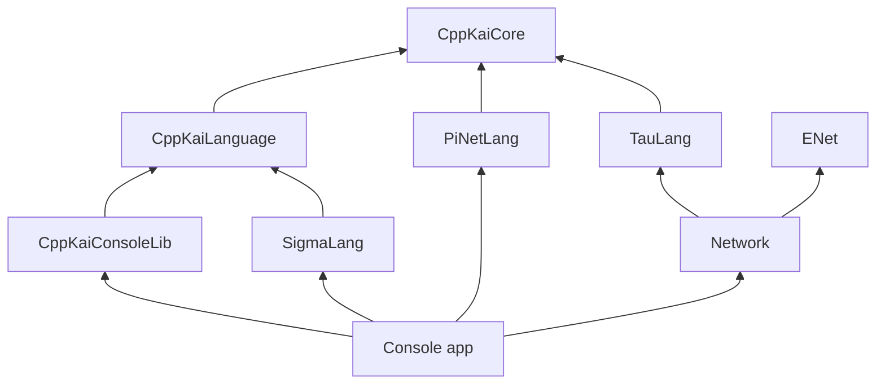

Core never depends on Sigma, PiNet or any front end. Extensions attach through hooks (`Console::AddTranslator`, `Console::AddSendCheck`) rather than direct references.

---

## Documentation

- **Start here**: [Documentation Guide](Doc/Documentation.md) | [Doc/ index](Doc/README.md) | [Project Overview](Doc/ProjectOverview.md) | [Architecture](Doc/Architecture.md)
- **Languages**: [Sigma](Doc/Sigma/README.md) | [Rho Tutorial](Doc/RhoTutorial.md) | [Pi Tutorial](Doc/PiTutorial.md) | [PiNet](Doc/PiNet.md) | [Tau Tutorial](Doc/TauTutorial.md) | [Language System](Include/KAI/Language/README.md)
- **Networking**: [Overview](Doc/Networking.md) | [Architecture](Doc/NetworkArchitecture.md) | [Peer to Peer](Doc/PeerToPeerNetworking.md) | [Console Networking](Doc/CONSOLE_NETWORKING.md)
- **Building**: [Build Guide](Doc/BUILD.md) | [Out-of-Source Builds](Doc/OUT_OF_SOURCE_BUILD.md) | [Install](Doc/Install.md) | [CMake](CMake/README.md)
- **Testing**: [Test Overview](Test/README.md) | [Language Tests](Test/Language/README.md) | [Network Tests](Test/Network/README.md) | [Test Summary](Doc/TEST_SUMMARY.md)
- **Diagrams**: [Architecture Resources](resources/README.md)
- **LLM tooling**: [LmmReadme](Doc/LmmReadme.md)
- **Status**: [TODO](Doc/TODO.md)

## Platforms

Windows 10/11 (VS 2022, VS 2026), Linux (Ubuntu, Debian, CentOS, WSL2), macOS, Android (library subset), Unity3D.

## License

MIT. See [LICENSE](LICENSE).
