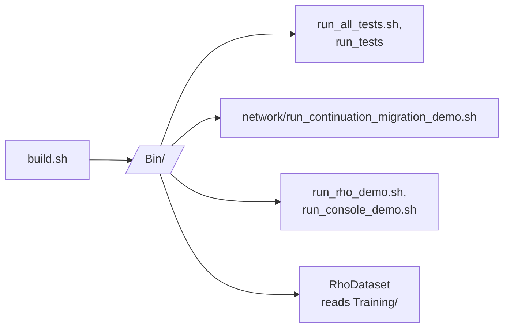

# Scripts

Utility scripts for building, testing and demonstrating KAI. On Windows, prefer `py build.py` and `py run.py` at the repository root.



## Build

| Script | Does |
|--------|------|
| `build.sh` | Deletes and recreates `build/`, then a Debug build with Clang and Ninja |
| `clean_and_build.sh`, `clean_build.sh` | Clean rebuilds |
| `buildtau.sh` | Build the Tau pieces |
| `build-android.sh` | Cross-compile `libkai.so` for Android (needs `ANDROID_NDK_HOME`); see [Android](../Android/README.md) |
| `install-llvm.sh` | Install the LLVM toolchain |

## Test

| Script | Does |
|--------|------|
| `run_all_tests.sh` | Every suite |
| `run_tests` | Deletes `build/`, rebuilds, and runs the binaries in `Bin/Test` |
| `run_rho_tests.sh` | Rho tests |
| `test_tau.sh`, `test_tau_interfaces.sh`, `test_tau_network.sh` | Tau tests |
| `run_connection_tests.sh`, `run_tau_connection_tests.sh`, `run_minimal_connection_demo.sh` | Network connections |
| `run_chat_tests.sh` | Chat tests |
| `run_fixed_tests.sh` | A historical subset from when many tests were failing |
| `mock_llm_inference.sh` | Stand-in model command for the LLM evaluation suite |

## Demos

| Script | Does |
|--------|------|
| `run_console_demo.sh` | Console demo |
| `run_rho_demo.sh` | Tour of Rho |
| [`network/run_continuation_migration_demo.sh`](network/README.md) | Freeze a Pi workflow in one process, resume it in another, return `42` |
| [`network/run_continuation_migration_tmux_demo.sh`](network/README.md) | The same, in tmux, paced for recording |

```bash
./Bin/ContinuationMobilityDemo
./Scripts/network/run_continuation_migration_demo.sh
```

## Analysis and housekeeping

| Script | Does |
|--------|------|
| `analyze_complexity.py` | Code complexity, configured by `complexity_config.json` |
| `analyze_test_history.sh` | Reports from test history |
| `tidy` | `clang-format -i` over `Source`, `Include` and `Test` |
| `r` | Repairs encoding artifacts in `Test/demo_console_communication.sh` |
| `remove_claude_refs.sh` | Removes AI-generated comments and references |

## Stale

These build or launch apps that no longer exist (`NetworkPeer`, `ConfigurableServer`, `ConfigurableClient`): `p2p_test.sh`, `p2p_test_dynamic.sh`, `p2p_test_simple.sh`, `p2p_test_standalone.sh`, `calc_test.sh`, `network/run_peers.sh` and `network/automated_demo.sh`. Use the Console's `/network` commands instead; see [Console Networking](../Doc/CONSOLE_NETWORKING.md).

## Folders

- [network/](network/README.md): networking demos
- [Training/](Training/README.md): lessons for the local LLM corpus

## Requirements

- CMake 3.28+, a C++23 compiler (Clang 16+ by default), Ninja
- tmux for the tmux demos
- Free local ports in the 14600 to 14699 range for network scripts

## Adding scripts

1. `chmod +x`
2. Usage comments at the top
3. Error handling and cleanup
4. Add it to this README

## See Also

- [Build Guide](../Doc/BUILD.md)
- [Test Guide](../Doc/Test.md)
- [Connection Testing](../Doc/ConnectionTesting.md)
