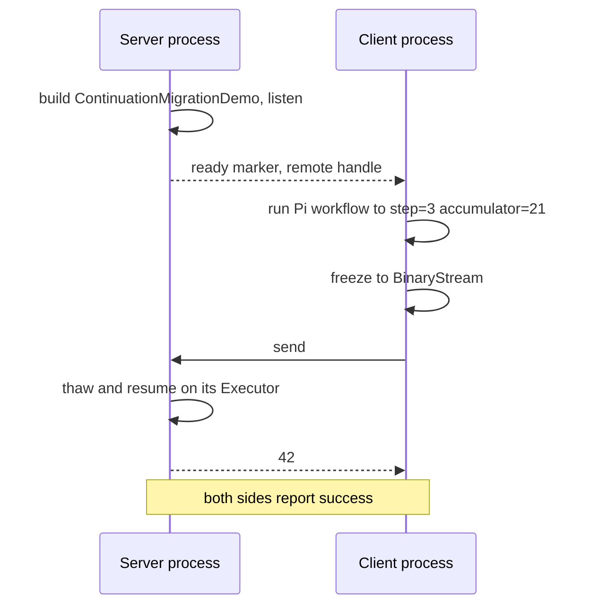

# Network Scripts

Scripts that demonstrate KAI's peer-to-peer networking, centred on moving a running continuation between processes.

## Continuation migration

`run_continuation_migration_demo.sh` starts a server and a client, sends a frozen, stateful Pi workflow over the network, thaws it on the server, and checks that it resumes from `step=3 accumulator=21` and returns `42`. It is the best automated proof that continuations move between nodes.



```bash
./Scripts/network/run_continuation_migration_demo.sh
```

Steps:
1. Build `ContinuationMigrationDemo`
2. Start the server and wait for its ready marker
3. Launch the client, which sends the frozen continuation
4. Check that both sides report success

### tmux version

`run_continuation_migration_tmux_demo.sh` does the same in a tmux session with side-by-side server and client panes, pausing between stages so it can be screen-recorded. The result stays on screen.

```bash
./Scripts/network/run_continuation_migration_tmux_demo.sh
```

## Stale scripts

`run_peers.sh` and `automated_demo.sh` build and run the `NetworkPeer` application, which no longer exists. Their peer configurations live in [`config/`](../../config/README.md). For interactive peer-to-peer use, run two Consoles:

```bash
# Console 1
π /network start 14600

# Console 2
π /network start 14601
π /connect localhost 14600
π /@0 2 3 +
π /peers
```

See [Console Networking](../../Doc/CONSOLE_NETWORKING.md).

## See Also

- [Networking](../../Doc/Networking.md)
- [Network tests](../../Test/Network/README.md)
- [config](../../config/README.md)
