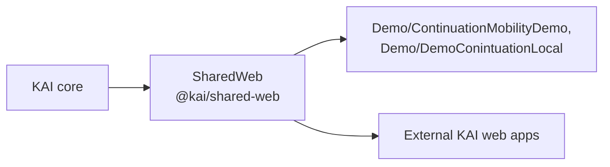

# KAI Shared Web

KAI-aware web components and browser-side runtime adapters, shared by the CppKAI demos and by external KAI web applications without CppKAI depending on those consumers.

| Path | Contents |
|------|----------|
| `components/` | Static HTML fragments used by the demos (`kai-pi-stack.html`, `kai-log-panel.html`) |
| `styles/` | Shared styling (`kai-shared.css`) |
| `src/components/` | TypeScript custom elements |
| `src/runtime/` | KAI runtime interfaces and shared types |
| `src/adapters/` | Platform bridge adapters |
| `src/index.ts` | Package entry point |



The dependency only ever points that way: KAI core to SharedWeb to consumers.

```bash
npm install
npm run build        # tsc
npm run typecheck
```
