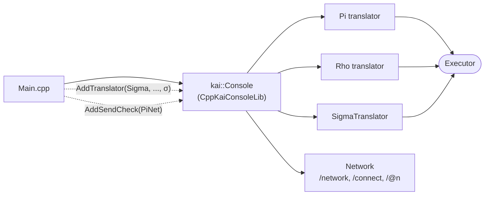
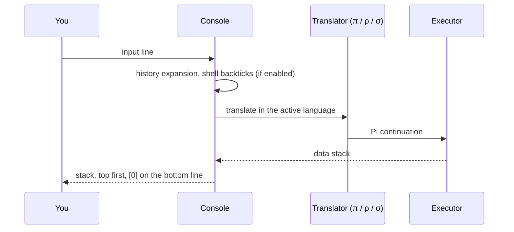

# Console 

The interactive REPL for KAI. It runs Pi, Rho and Sigma on one Executor and one shared stack, switches language on the fly, and talks to other consoles peer to peer.

```bash
./Bin/Console                    # interactive Pi (default)
./Bin/Console -l rho             # interactive Rho
./Bin/Console -l sigma           # interactive Sigma
./Bin/Console script.sigma       # run a script; language from .pi, .rho or .sigma
./Bin/Console -t 2 script.rho    # with trace level 2
```

Built-in commands: `help`, `clear`, `exit`, `quit`, `pi`, `rho`, `sigma`, `history`, `stack`.

## How it is put together

The app is thin. The console itself is `CppKaiConsoleLib`; the app registers the CppKAI-only languages and checks with it, so neither CppKaiCore nor ConsoleLib depends on them.





## Features

- **Languages**: Pi (`π`), Rho (`ρ`) and Sigma (`σ`); the prompt shows only the active symbol
- **Stack display**: the whole data stack after each command, top first, `[0]` at the bottom
- **History**: persisted in `~/.kai_history`; zsh-style expansion (`!!`, `!n`, `^old^new^`, word designators, modifiers)
- **Networking**: `/network start`, `/connect`, `/@<peer>`, `/broadcast`, `/peers`; see [Console Networking](../../../Doc/CONSOLE_NETWORKING.md)
- **PiNet**: `send` refuses a continuation that uses names it does not bind; see [PiNet](../../../Doc/PiNet.md)
- **Shell commands**: backticks, `$ cmd`, and `sh` mode. **Off by default**; build with `-DENABLE_SHELL_SYNTAX=ON`. Native Windows then routes commands through WSL2's bash
- **Colour**: strings and integers keep type cues; floats use the neutral value colour
- **Executor inspection**: machine-readable snapshots of every live Executor and its own Tree
- **Logging**: startup, tree snapshots, debugger actions and failures go through KAI's `Logger`

## Shell commands

With shell syntax enabled:

```
π `pwd
/home/user/project

π 10 `echo 5` +
[0]: 15

π 1 `echo 2` + 3 ==
[0]: true
```

## Other executables

With networking on, this target also builds:

| Executable | Purpose |
|------------|---------|
| `SimpleServer`, `SimpleClient` | Minimal Node examples |
| `ContinuationMigrationDemo` | Freeze a Pi workflow in one process, resume it in another; driven by `Scripts/network/run_continuation_migration_demo.sh` |

## Documentation

- [Console guide](../../../Doc/Console.md)
- [Console sources and feature docs](Source/README.md)
- [Console Networking](../../../Doc/CONSOLE_NETWORKING.md)
- [Console tests](../../../Test/Console/README.md) and [shell command tests](../../../Test/ShellCommandTests/README.md)
