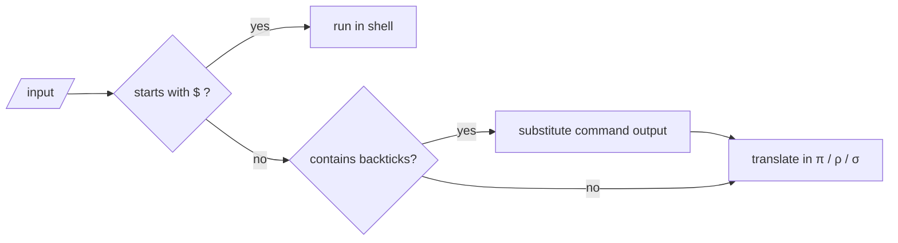
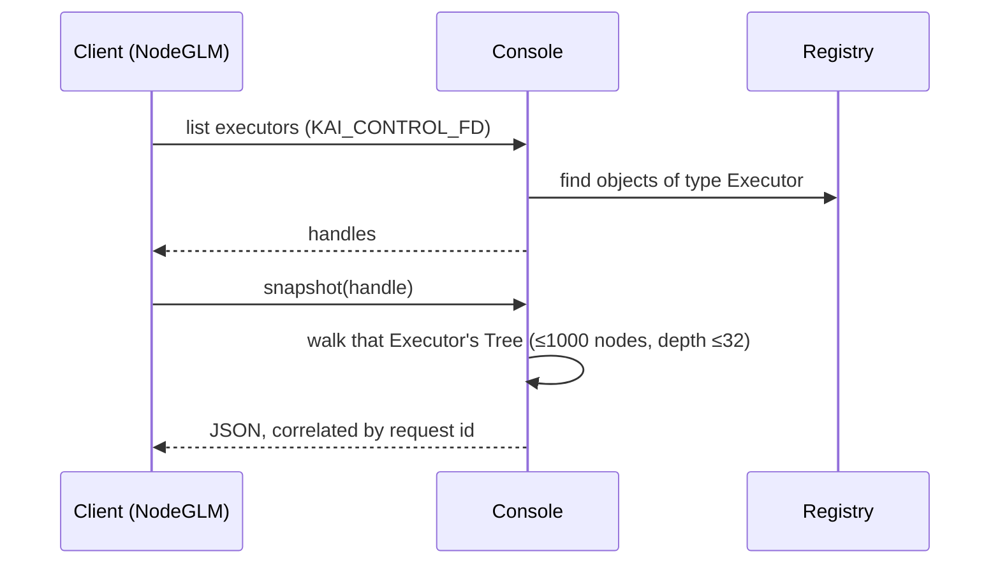

# Console Sources and Feature Docs

Sources for the Console app, plus the feature walkthroughs written while the console was built. For the overview, see the [Console README](../README.md).

## Sources

| File | Purpose |
|------|---------|
| `Main.cpp` | Command line, language selection, registers Sigma (`AddTranslator`) and PiNet (`AddSendCheck`) |
| `EnhancedConsole.cpp/.h` | Console extensions used by the app |
| `ExampleNewLanguage.cpp` | How to plug a new language into the console |
| `SimpleServer.cpp`, `SimpleClient.cpp` | Minimal networking examples |
| `ContinuationMigrationDemo.cpp` | Cross-process continuation migration |

The console implementation itself is in `Ext/CppKaiConsoleLib` (`Include/KAI/Console/Console.h`, `Source/Console.cpp`). The Window app uses the same library, so console features work identically there.

## Quick start

```console
π 2 3 +
[0]: 5

π { 2 * } 'double #     // store a continuation
π 7 double &            // run it
[0]: 14

π rho
Switched to Rho language mode

ρ x = 42; y = x * 2; y
[0]: 84
```

Multi-line Rho and Sigma programs are easiest to run as files: `./Bin/Console prog.rho`, `./Bin/Console prog.sigma`.

## Shell integration

Off by default; build with `-DENABLE_SHELL_SYNTAX=ON`. Three forms:

1. **Backticks**: `` `ls -la` `` runs a command and continues in the current language
2. **Dollar prefix**: `$ ls -la`
3. **Shell mode**: `sh` switches to a `$` prompt; `exit` returns



## History expansion

| Feature | Syntax |
|---------|--------|
| Basic | `!!`, `!n`, `!-n`, `!string`, `!?string?` |
| Word designators | `:0`, `:^`, `:$`, `:*`, `:n`, `:n-m`, `:n*`, `!$`, `!^` |
| Quick substitution | `^old^new^` |
| Modifiers | `:h`, `:t`, `:r`, `:e`, `:p`, `:u`, `:l`, `:q`, `:x` |
| Substitutions | `:s/old/new/`, `:gs/old/new/` |

```console
π /path/to/some/file.txt
π !!:h                      # /path/to/some
π !!:t                      # file.txt
```

## Executor inspection

The private NodeGLM inspection protocol, implemented in ConsoleLib's `Console.cpp`, enumerates Registry objects of type `Executor`, identifies each by handle, and serialises the selected Executor's own Tree. Debug and Tree clients must name an Executor explicitly. Traversal is bounded to 1000 nodes and depth 32. Requests and request-ID-correlated newline-delimited JSON responses use the duplex `KAI_CONTROL_FD`; operational events and failures go to KAI's `Logger`, and stdout stays the user-facing terminal stream.



## Feature walkthroughs

### Getting started
- [QuickStartGuide.md](QuickStartGuide.md)
- [ShellModeDemo.md](ShellModeDemo.md)
- [TestAllFeatures.md](TestAllFeatures.md)

### History and shell features
- [TestZshFeatures.md](TestZshFeatures.md)
- [ZshQuickReference.md](ZshQuickReference.md)
- [AdvancedZshFeatures.md](AdvancedZshFeatures.md)

### Examples and sessions
- [VisualDemo.md](VisualDemo.md)
- [CommonUsage.md](CommonUsage.md)
- [InteractiveExamples.md](InteractiveExamples.md)
- [InteractiveDemo.md](InteractiveDemo.md)
- [TypicalSession.md](TypicalSession.md)
- [AdvancedDemo.md](AdvancedDemo.md)
- [ClarificationDemo.md](ClarificationDemo.md)

### Historical notes
- [ImplementationSummary.md](ImplementationSummary.md), [ArrayInsertTestsSummary.md](ArrayInsertTestsSummary.md), [ArrayTestRefactoringSummary.md](ArrayTestRefactoringSummary.md), [ContainerTestRefactoringSummary.md](ContainerTestRefactoringSummary.md), [TestRefactoringComplete.md](TestRefactoringComplete.md)

## Testing

See [Test/Console](../../../../Test/Console/README.md): gtest suites (`TestConsoleZshFeatures.cpp`, `TestAdvancedZshFeatures.cpp`), `RunConsoleTests.sh`, `TestConsoleZsh.py` and `InteractiveTests.txt`.
