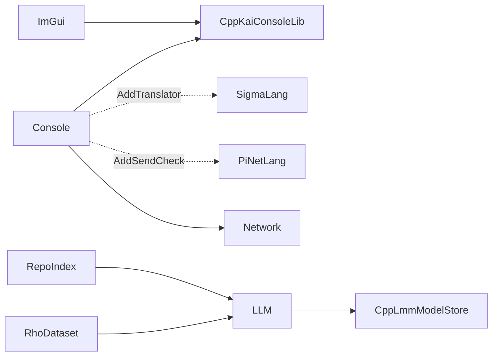

# KAI Applications

Executables are written to `Bin/`.

| App | Executable | Built when | What it is |
|-----|------------|------------|------------|
| [Console](Console/README.md) | `Console` | always | Coloured REPL onto an Executor: Pi, Rho and Sigma, with peer-to-peer networking |
| [Window](Window/README.md) | `ImGui` | `KAI_BUILD_IMGUI=ON` (`py build.py --imgui`) | Dear ImGui console, debugger and object-tree viewer |
| [RepoIndex](RepoIndex/README.md) | `RepoIndex` | `KAI_BUILD_LLM=ON` | Local code and test knowledge base for retrieval |
| [RhoDataset](RhoDataset/README.md) | `RhoDataset` | `KAI_BUILD_LLM=ON` | JSONL training corpus from Rho, Pi, Tau, tests, logs, history, READMEs and `Scripts/Training` |

With networking on, the Console target also builds `SimpleServer`, `SimpleClient` and `ContinuationMigrationDemo`.

`Chat/` holds only `ChatInterface.tau`, a Tau interface for a chat service; nothing is built from it.

The old `NetworkGenerate` tool has been removed. Tau Agent and Proxy generation is a library call (`tau::Generate::*`); see [Tau](../../Include/KAI/Language/Tau/README.md).

Other front ends on the same object model, such as [ksh](../../ksh/README.md), live outside this folder.
