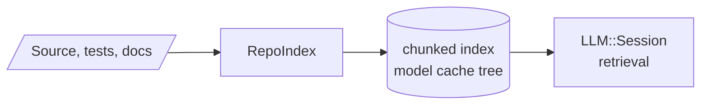

# RepoIndex

Scans the KAI repository and builds a local chunked knowledge base for assistant-style retrieval. Built with `-DKAI_BUILD_LLM=ON`.



By default it writes to the local model cache from `CppLmmModelStore` (`~/.cache/deepseek/models`):

```bash
./Bin/RepoIndex
```

To index a different tree or write elsewhere:

```bash
./Bin/RepoIndex --root /path/to/KAI --out /tmp/kai-index
```

See [LmmReadme](../../../Doc/LmmReadme.md).
