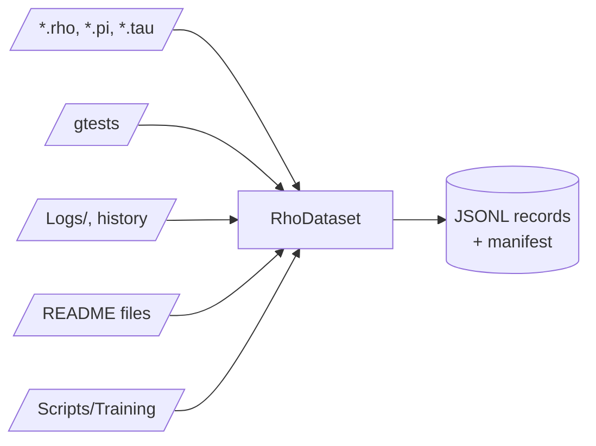

# RhoDataset

The local KAI language dataset builder (the name is historical; it covers more than Rho). It writes JSONL records for Rho, Pi, Tau, gtest evidence, logs, history files, README documentation and incremental lessons from `Scripts/Training`, under the same cache tree as the other LLM tools. Built with `-DKAI_BUILD_LLM=ON`.



It builds corpus records; it does not mean KAI contains trained weights. The output can be used for retrieval, supervised examples, fine-tuning, or a later llama.cpp or CppLmmModelStore training pipeline. The manifest records what went in.

It ingests the local corpus silently. It only asks for confirmation when a proposed addition would have a large impact on scope or provenance.

```bash
./Bin/RhoDataset
./Bin/RhoDataset --root /path/to/KAI --out /tmp/kai-language-training
```

See [LmmReadme](../../../Doc/LmmReadme.md) and [Scripts/Training](../../../Scripts/Training/README.md).
