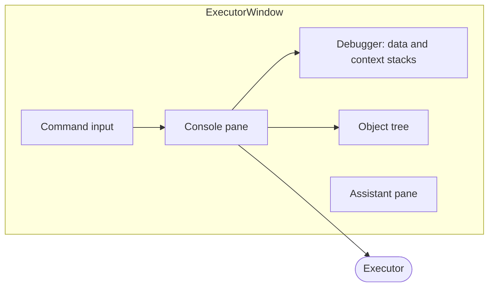

# ImGui Window 

A GUI console and debugger for KAI built on [Dear ImGui](https://github.com/ocornut/imgui), GLFW and OpenGL 3. The executable is `ImGui`.

```bash
cmake -S . -B build -DKAI_BUILD_IMGUI=ON    # Linux / macOS
py build.py --imgui                          # Windows (needs glfw3 and GLEW, e.g. via vcpkg)
py run.py window
```

The window shows how Rho is transpiled to Pi, and lets you step the Executor:



| Source | Pane |
|--------|------|
| `ExecutorWindowConsole.cpp` | REPL input and output |
| `ExecutorWindowDebugger.cpp` | Stack view and stepping |
| `ExecutorWindowTree.cpp` | Registry object tree |
| `ExecutorWindowCommand.cpp` | Command handling |
| `ExecutorWindowAssistant.cpp` | Assistant pane: HTTP client (cpp-httplib) to a local LLM chat server |

Tests are in [Test/Window](../../../Test/Window/README.md). A Slint port is in progress behind `KAI_BUILD_SLINT`.
