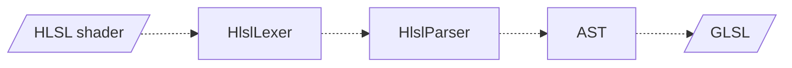

# Hlsl

An experimental front end for HLSL, Microsoft's High Level Shader Language for DirectX.

The aim is to produce an AST for an HLSL shader, which can then be used to generate equivalent GLSL. The original goal was to reuse ShaderToy-style raymarching distance-field shaders in 360° Unity3D VR apps.

**Status:** not built. Headers are in [`Include/KAI/Language/Hlsl`](../../../../Include/KAI/Language/Hlsl) (`HlslLexer`, `HlslParser`, `HlslTranslator`), and the only test, [`Test/Language/TestHlsl`](../../../../Test/Language/TestHlsl), is commented out.

