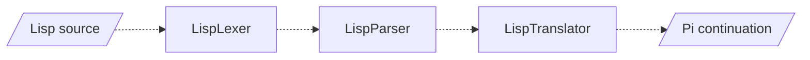

# Lisp

A placeholder for a Lisp front end that would compile to Pi, the same way Rho does.

**Status:** not built and not tested. The sources under [`Source/`](Source) were copied from Rho and have not been converted: `LispTranslator.cpp`, for example, still implements `RhoTranslator`. The headers in [`Include/KAI/Language/Lisp`](../../../../Include/KAI/Language/Lisp) declare the intended `LispLexer`, `LispParser` and `LispTranslator` on the `Language/Common` framework.

