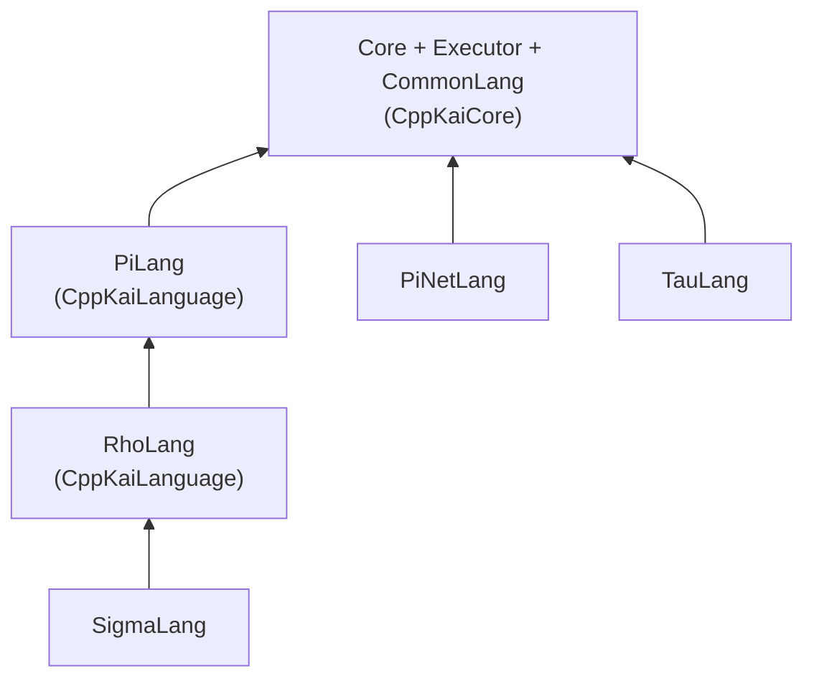

# Language

Sources for the language libraries built in CppKAI. Pi and Rho are not here: they come from the [CppKaiLanguage](../../../Ext/CppKaiLanguage) submodule, and the shared lexer, parser and translator framework (`CommonLang`) comes from [CppKaiCore](../../../Ext/CppKaiCore).

| Directory | Library | Built when | Links |
|-----------|---------|------------|-------|
| [`Sigma/`](Sigma) | `SigmaLang` | always | `RhoLang`, `PiLang`, `CommonLang`, `Executor`, `Core` |
| [`PiNet/`](PiNet) | `PiNetLang` | always | `Executor`, `Core` |
| [`Tau/`](Tau) | `TauLang` | `KAI_NETWORKING` and not `KAI_ANDROID` | `CommonLang`, `Executor` |
| [`Lisp/`](Lisp) | | not built | |
| [`Hlsl/`](Hlsl) | | not built | |

## Sigma

A statically typed infix language with Rho's syntax. Every program is type-checked before it runs; a program with a type error does not run at all. Sigma compiles to Rho. See [Doc/Sigma](../../../Doc/Sigma/README.md).

## PiNet

The rule a continuation must satisfy to be sent to another node: it may only use names it binds itself. The Console app registers it with `Console::AddSendCheck`, so neither Core nor ConsoleLib depends on it. See [Doc/PiNet.md](../../../Doc/PiNet.md).

## Tau

An Interface Definition Language. A network entity begins as a Tau definition; the generator produces a consumer **Proxy** and a producer **Agent**, which link statically into executables that talk through a `Node`. See [Tau/Source](Tau/Source/README.md).

## Lisp and Hlsl

Neither is wired into the build. See their READMEs for status.
