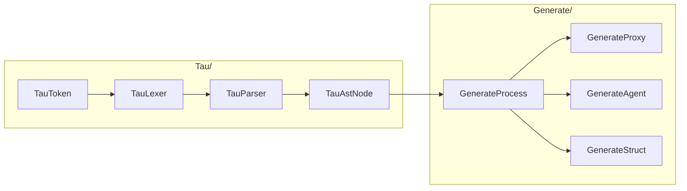

# Tau Sources

The `TauLang` library, built when `KAI_NETWORKING` is on and `KAI_ANDROID` is off. It has two parts.

## [Tau/](Tau): the language

Lexer and parser for `.tau` files, producing an AST of namespaces, interfaces, methods, properties, events, structs and enums.

- **TauToken**: token types
- **TauLexer**: source to tokens
- **TauParser**: tokens to AST, including nested `namespace A::B::C`, interface inheritance and default parameter values
- **TauAstNode**: AST nodes

## [Generate/](Generate): the generator

Walks the AST and writes C++.

- **GenerateProcess**: base class for all generators
- **GenerateProxy**: client-side `<Name>Proxy` classes that forward calls and return futures
- **GenerateAgent**: server-side `<Name>Agent` classes that handle incoming calls
- **GenerateStruct**: plain data structs

Generated code covers method signatures matching the interface, argument and result serialisation, event registration and triggering, and the network plumbing to a `Node`.

## See Also

- [Tau headers](../../../../../Include/KAI/Language/Tau/README.md)
- [Tau Tutorial](../../../../../Doc/TauTutorial.md)
- [Tests](../../../../../Test/Language/TestTau/README.md)
