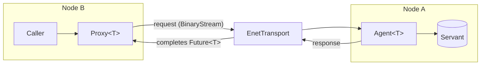

# Network

The `Network` library: Nodes, Domains, Agents and Proxies over ENet UDP. Built when `KAI_NETWORKING=ON` (the default). Headers are in [`Include/KAI/Network`](../../../../Include/KAI/Network).

It lets you write code that is deeply network-dependent without callbacks-within-callbacks and without explicit threading: every remote call returns a `Future<T>`.



```cpp
Node local;
local.Connect(IpAddress("192.168.1.10"), 14600);

IFooProxy foo(local, NetHandle(1234));   // generated from Foo.tau; how you get the handle is up to you
Future<int> result = foo.TimesTwo(5);    // returns immediately
local.Step();                                               // pump the network
if (result.IsComplete())
    std::cout << result.GetValue();
```

## Concepts

| Type | Role |
|------|------|
| `Node` | One peer: `Listen`, `Connect`, `Step`, connection events |
| `Domain` | The set of nodes that share object handles. Wraps a `Node` and creates Agents (`MakeAgent<T>`) and Proxies (`MakeProxy<T>(NetHandle)`). Objects in a Domain have a unique `NetHandle`, as objects in a Registry have a unique `Handle` |
| `Agent<T>` | Responds to requests for a servant on this node |
| `Proxy<T>` | Local representative of a remote agent. Methods, properties and events are used as if local; every result is a `Future<T>` |
| `Future<T>` | Shared-state result: `IsComplete`, `GetValue`, `OnResolved`. Nests cleanly as `Future<Future<T>>` |
| `PeerDiscovery` | Finding peers |
| `ConnectionManager` | Connection lifecycle and events |

Agent and Proxy classes for an interface are normally generated from Tau; see [Tau](../../../../Include/KAI/Language/Tau/README.md).

## Sources

| File | Contents |
|------|----------|
| `Node.cpp` | Node lifecycle, listen, connect, step |
| `EnetTransport.cpp` | ENet UDP transport |
| `ConnectionManager.cpp` | Connections and connection events |
| `PeerDiscovery.cpp` | Peer discovery |
| `AgentBase.cpp` | Agent dispatch |
| `NetworkLogger.cpp` | Network logging |

Application code never touches ENet directly; the transport is behind `Transport`.

See [Networking](../../../../Doc/Networking.md), [Network Architecture](../../../../Doc/NetworkArchitecture.md) and [Network tests](../../../../Test/Network/README.md).
