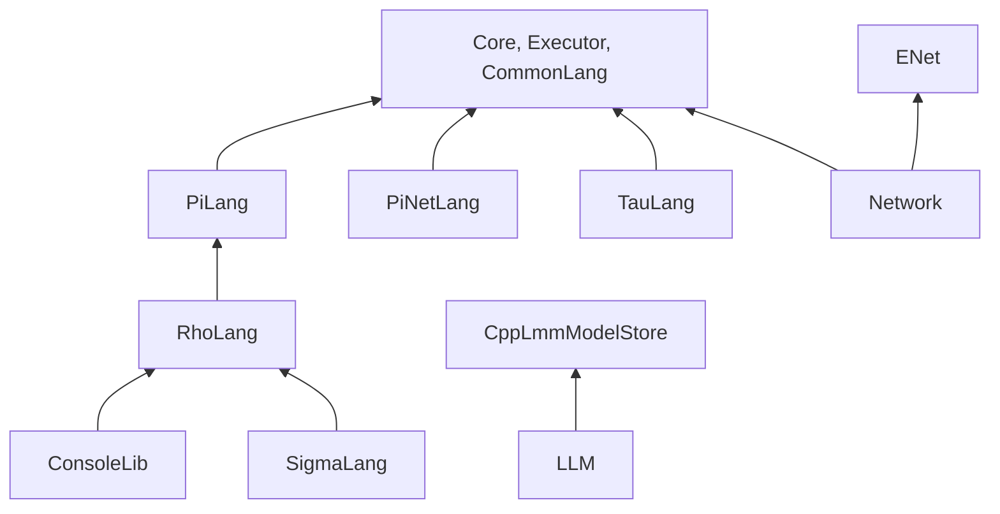

# Library

Libraries built from this repo, and where the rest come from.

| Library | Source | Notes |
|---------|--------|-------|
| `Core` | `Ext/CppKaiCore` | Objects, type traits, Registry, Tree, tri-colour GC |
| `Executor` | `Ext/CppKaiCore` | The two-stack virtual machine (data and context) |
| `CommonLang` | `Ext/CppKaiCore` | Lexing, parsing, AST and translation, parameterised over token and node types |
| `PiLang`, `RhoLang` | `Ext/CppKaiLanguage` | Pi and Rho |
| `ConsoleLib` | `Ext/CppKaiConsoleLib` | Console, `AddTranslator`, `AddSendCheck` |
| `SigmaLang` | [Language/Sigma](Language/README.md) | Statically typed, compiles to Rho |
| `PiNetLang` | [Language/PiNet](Language/README.md) | Send check for transportable continuations |
| `TauLang` | [Language/Tau](Language/Tau/Source/README.md) | IDL and Agent/Proxy generator; needs `KAI_NETWORKING` |
| `Network` | [Network](Network/Source/README.md) | Node, Domain, Agent, Proxy, `Future<T>` over ENet; needs `KAI_NETWORKING` |
| `ImGuiLib` | `ImGui/` | Dear ImGui build for the Window app; needs `KAI_BUILD_IMGUI` |
| LLM | `LLM/` | `ModelCache`, `Session`, `RepoIndexer`, `RhoDataset`; needs `KAI_BUILD_LLM`. Models default to `~/.cache/deepseek/models`, backed by `Ext/CppLmmModelStore` |
| Platform | [Platform](Platform/README.md) | Platform-specific code |

`Rho/` is a historical note only; see [Rho](Rho/README.md).
