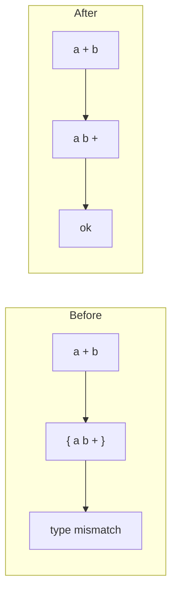

# Rho (historical)

Rho itself no longer lives here. `RhoLang` is built from the [CppKaiLanguage](../../../Ext/CppKaiLanguage) submodule. This directory holds only `DiagnoseTests.cpp`, a standalone diagnostic that is not part of the build, and this note.

## The continuation-wrapping fix

An earlier `RhoTranslator` wrapped binary operations, calls and assignments in their own `Continuation`s, which caused type-mismatch errors at runtime. In Pi, binary operations are appended directly to the code array, so the wrappers were removed:

| Translator method | Change |
|-------------------|--------|
| `TranslateBinaryOp` | Append the operation directly; no `PushNew()` / `Append(Pop())` |
| `TranslateCall` | No wrapping continuation |
| `TranslateIf` | Continuations for the then and else blocks only |
| `TranslateFunction` | One continuation for the body, not wrapped again |
| `TranslateWhile`, `TranslateDoWhile` | No extra nesting |
| Assignment | No wrapping continuation |

This is kept for history. For current Rho status see [Doc/TODO.md](../../../Doc/TODO.md) and [Doc/TEST_SUMMARY.md](../../../Doc/TEST_SUMMARY.md); for the language, see the [Rho Tutorial](../../../Doc/RhoTutorial.md).
