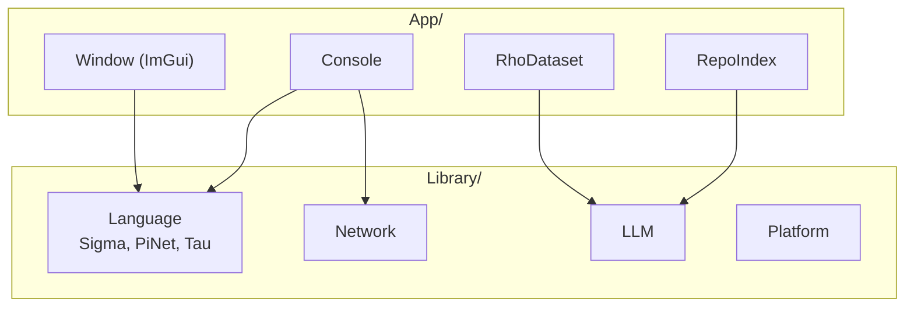

# Source

- **[App](App/README.md)**: executables built on KAI: Console, Window (ImGui), RepoIndex and RhoDataset
- **[Library](Library/README.md)**: the libraries built in this repo. Core, Executor, `Language/Common`, Pi and Rho come from the `Ext/CppKaiCore` and `Ext/CppKaiLanguage` submodules
