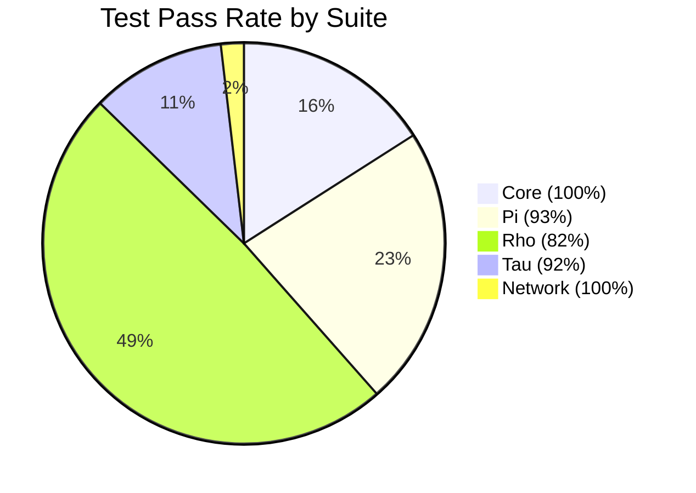

# KAI Project Test Summary

Generated: 2026-04-01

## Overall Status



| Suite | Passed | Total | Rate | Notes |
|-------|--------|-------|------|-------|
| Core | 147 | 147 | 100% | All passing |
| Pi | 208 | 223 | 93% | Backtick shell tests disabled |
| Rho | ~450 | ~550 | ~82% | Inline function calls in loops still failing |
| Tau | ~100 | ~109 | 92% | All code-gen tests passing |
| Network | 17 | 17 | 100% | All E2E tests passing |

## Test Suite Details

### Core Tests
- **Status**: All 147 tests passing
- Registry, type system, memory management, garbage collection, BinaryStream, Array, Map

### Pi Language Tests
- **Status**: 208/223 passing (93%)
- Backtick shell operations are disabled by default (`-DENABLE_SHELL_SYNTAX=ON` to enable)
- Stack operations, control flow, continuations, functions all working

### Rho Language Tests
- **Status**: ~82% passing
- Core features working: expressions, conditionals, while/do-while, for loops, functions, recursion
- Remaining failures: inline function calls inside `for x in container` loops (returns 0 instead of computed value)
- Break/continue edge cases in certain nested-loop patterns

### Tau Language Tests
- **Status**: ~92% passing
- Namespace/class/interface parsing, code generation, struct generation all working
- `Future<T>` return types now parse correctly (lexer fix: `Future<int>` is a single token)

### Network Tests
- **Status**: 17/17 passing (100%)
- Built only when `KAI_NETWORKING=ON` (use `./b --network`)

#### NodeEndToEndTest (6 tests)
| Test | Description |
|------|-------------|
| `RemoteMethodCallReturnsCorrectValue` | Client calls `Add(3,4)` on server agent, receives 7 |
| `EventBroadcastReachesSubscriber` | Server broadcasts `Ping`, client subscriber fires |
| `ObjectMessageReachesSubscriber` | Server sends `int 42` object, client receives it |
| `EventPayloadDecodedCorrectly` | Server broadcasts `Score` with int payload 99 |
| `RemotePropertyGetReturnsValue` | Client fetches `Counter` property (value 55) from server |
| `RemotePropertySetUpdatesValue` | Client sets `Counter` to 77, server value updates |

#### TauDomainPropertyTest (3 tests)
| Test | Description |
|------|-------------|
| `IdlGeneratesExpectedClassNames` | `.tau` IDL generates `ISensorProxy` / `ISensorAgent` |
| `DomainBProxyFetchesPropertyFromDomainA` | Domain B reads `Value=42` from Domain A agent |
| `DomainBProxySetsPropertyOnDomainA` | Domain B writes `Value=99`, Domain A servant reflects it |

#### TauPiSerializationTest (1 test)
| Test | Description |
|------|-------------|
| `LocalNodeRoundTrip` | Two nodes: Tau-generated proxy calls `Add(2,3)`, expects 5 |

#### TauNetworkCommunicationTest (4 tests)
- IDL parsing, proxy/agent generation, error handling

#### TestGenerateProxy (3 tests)
- Proxy code generation from Tau input

## Build Commands

```bash
# Run all non-network tests (default build)
./b
./Bin/Test/TestCore
./Bin/Test/TestPi
./Bin/Test/TestRho
./Bin/Test/TestTau

# Run network tests (requires --network build)
./b --network
./Bin/Test_Network

# Filter specific tests
./Bin/Test/TestRho --gtest_filter="*ForLoop*"
./Bin/Test_Network --gtest_filter="TauDomainPropertyTest*"
```

## Recent Improvements (2026)

- **Network layer**: Complete `Node`/`Domain`/`Agent`/`Proxy` RPC system over ENet UDP
- **Remote property get/set**: `FetchProperty<T>` and `StoreProperty<T>` work across nodes
- **`KAI_NETWORKING` flag**: Single CMake option controls entire networking stack (default OFF)
- **`./b --network`**: Build script switch to enable networking
- **`SendReliability`/`SendRouting` enums**: Type-safe network send API
- **`BufferOffset` type**: Replaces bare `int` channel argument in `Send()`
- **Tau lexer fix**: `Future<int>` is now a single `Ident` token — template return types parse correctly
- **`TauDomainPropertyTest`**: New cross-domain agent/proxy property tests
