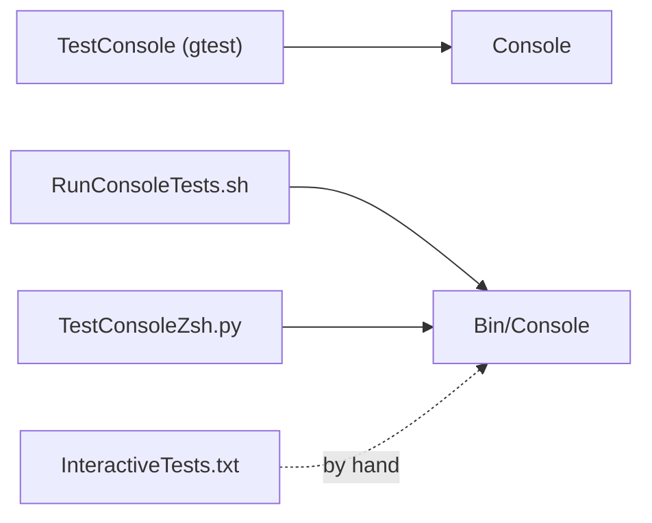

# Console Tests

Tests for the KAI Console: commands, languages, history expansion and console networking.



## Files

| File | Kind | Built |
|------|------|-------|
| `ConsoleRegressionTests.cpp` | gtest | yes, in `TestConsole` |
| `TestConsoleNetworking.cpp` | gtest | yes, in `TestConsole` |
| `TestAdvancedZshFeatures.cpp` | gtest | no, not in the CMake target |
| `RunConsoleTests.sh` | shell script against `Bin/Console` | |
| `TestConsoleZsh.py` | Python script against `Bin/Console` | |
| `InteractiveTests.txt`, `demo_zsh_features.txt` | manual cases | |

## Features covered

**History expansion**
- `!!`, `!n` (1-based), `!-n`, `!string`
- Word designators `:0`, `:^`, `:$`, `:*`, `:n`, `:n-m`, `:n*`, and combinations such as `!-3:4*`
- Expansion inside commands (`!! * 2`) and several references in one line (`!-2 + !-1`)
- Modifiers `:h`, `:t`, `:r`, `:e`, `:p`, `:u`, `:l`, `:q`, `:x` and substitutions `:s/old/new/`, `:gs/old/new/`

**Shell commands** (with `ENABLE_SHELL_SYNTAX=ON`)
- Backticks, embedded substitution, `$` prefix (which disables history expansion)

**Languages and networking**
- Switching between `pi`, `rho` and `sigma`
- Console-to-console commands: `/network start`, `/connect`, `/@n`, `/broadcast`

**Expected behaviour**
- An expansion echoes the expanded command with a `=> ` prefix
- A missing history reference prints `No matching command in history`
- History is saved to `~/.kai_history`

## Running

```bash
cmake --build build --target TestConsole
./Bin/Test/TestConsole

cd Test/Console
./RunConsoleTests.sh
./TestConsoleZsh.py
```

## Adding tests

- gtest: add cases to `ConsoleRegressionTests.cpp` (or a new file listed in `CMakeLists.txt`)
- scripts: add `run_test` calls to `RunConsoleTests.sh`, or `self.test()` calls to `TestConsoleZsh.py`
- manual: add to `InteractiveTests.txt`

## See Also

- [Console](../../Source/App/Console/README.md)
- [Console feature docs](../../Source/App/Console/Source/README.md)
- [ZshQuickReference](../../Source/App/Console/Source/ZshQuickReference.md)
- [Shell command tests](../ShellCommandTests/README.md)
