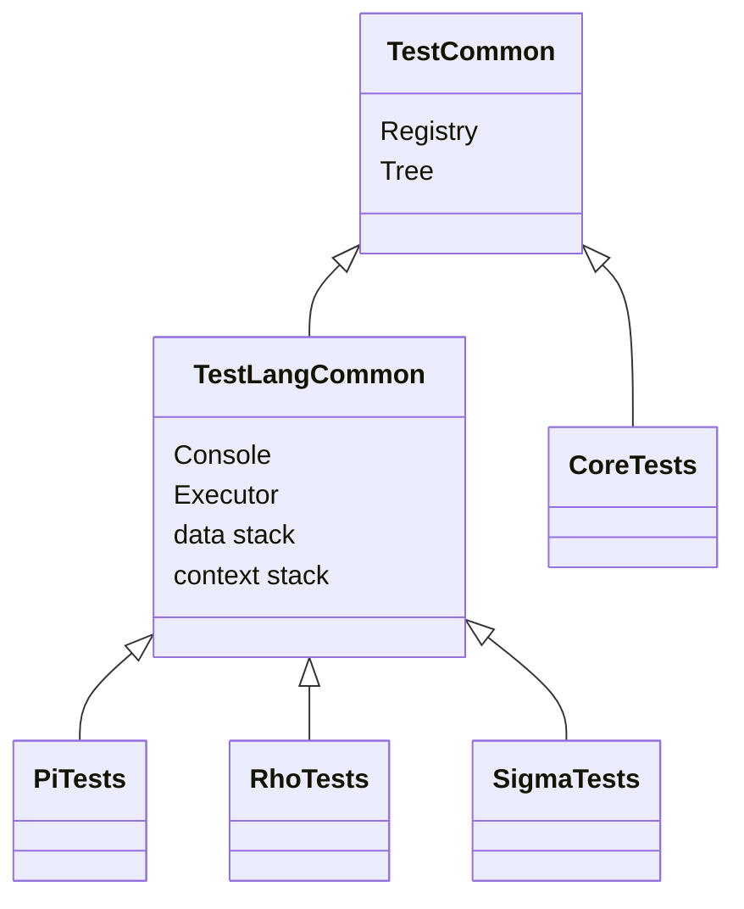

# Shared Test Headers

Base classes and helpers used across the test suites.

| Header | Purpose |
|--------|---------|
| `TestCommon.h` | Minimal fixture: a `Registry` and a `Tree` |
| `TestLangCommon.h` | Language fixture: a `Console`, its `Executor`, and direct access to the data and context stacks |
| `CoreTestCommon.h` | Helpers for the core suite |
| `TestConsoleHelper.h` | Driving a console from a test |
| `TestRhoScriptRunner.h` | Running Rho script files as tests |
| `MyTestStruct.h` | A sample reflected type |

Their sources are in `Test/Common` (`TestCommon.cpp`, `MyTestStruct.cpp`) and `Test/Language/TestLangCommon.cpp`. See [Test/Source/Common](../Source/Common/README.md) for more.
