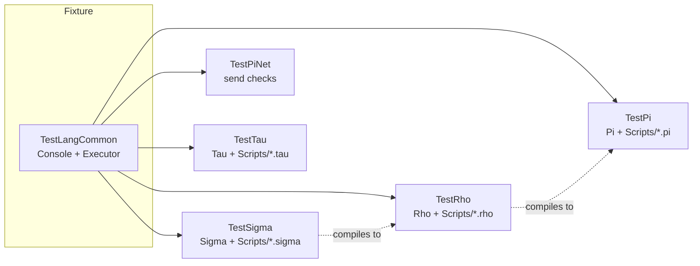

# Language Tests

One gtest executable per language, built from `Test/Language/CMakeLists.txt`: **TestPi**, **TestRho**, **TestSigma**, **TestPiNet**, and **TestTau** when networking is on. Each links `ConsoleLib`, the Executor, Core and every language library, and shares `TestLangCommon.cpp` as its fixture.



| Folder | Executable | Covers |
|--------|------------|--------|
| [TestPi](TestPi/README.md) | `TestPi` | Arithmetic, stack manipulation, strings, arrays, control flow, continuations, Suspend/Resume/Replace, tail recursion, backtick shell commands |
| [TestRho](TestRho/README.md) | `TestRho` | Expressions, control flow, functions, closures, iteration, early returns, translation to Pi, mixed-language programs |
| `TestSigma` | `TestSigma` | Type checking and `line:col` errors, generated Rho, templates, variadics, `&` and `!`, one test per program in `Scripts/*.sigma`. See [Sigma](../../Doc/Sigma/README.md#source-and-tests) |
| `TestPiNet` | `TestPiNet` | Which continuations may be sent, and the error for those that may not. See [PiNet](../../Doc/PiNet.md) |
| [TestTau](TestTau/README.md) | `TestTau` | Namespaces, classes, interfaces, structs, enums, `Future<T>`, Agent/Proxy generation, malformed input |
| `TestHlsl` | | Commented out; not built |

`MultiLanguageIntegrationTests.cpp` is kept but not built.

## Running

```bash
ctest --test-dir build -R TestPi
ctest --test-dir build -R TestSigma -V
./Bin/Test/TestRho --gtest_filter=RhoEarlyReturn*
```

On Windows, `py run.py test-pi` builds and runs TestPi alone.

## Example scripts

| Folder | Contents |
|--------|----------|
| `TestPi/Scripts/*.pi` | Arithmetic, arrays, strings, continuations, scope |
| `TestRho/Scripts/*.rho` | Functions, closures, collections, control flow |
| `TestSigma/Scripts/*.sigma` | Sorting, a prime sieve, matrices, recursion, higher-order functions, lists and maps; each must type-check, run, and end with `true` |
| `TestTau/Scripts/*.tau` | Reference inputs: interfaces, namespaces, inheritance, and intentional errors |

## Adding tests

1. Follow the structure of the language's folder; Pi, Rho and Tau list their sources explicitly in `CMakeLists.txt`; Sigma and PiNet are globbed
2. Add both passing and rejected cases
3. Add an example script where it shows the feature
4. Update this README and [Doc/TEST_SUMMARY.md](../../Doc/TEST_SUMMARY.md)

## See Also

- [Pi Tutorial](../../Doc/PiTutorial.md), [Rho Tutorial](../../Doc/RhoTutorial.md), [Sigma](../../Doc/Sigma/README.md), [PiNet](../../Doc/PiNet.md), [Tau Tutorial](../../Doc/TauTutorial.md)
- [Language Guide](../../Doc/LanguageGuide.md)
- [Common Language System](../../Doc/CommonLanguageSystem.md)
