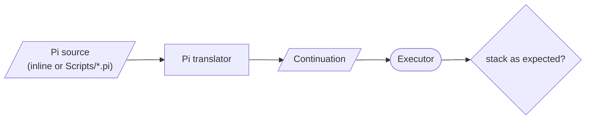

# TestPi

Tests for Pi, the bedrock RPN language. Most suites are inline gtest cases that feed Pi source straight to the Executor, which keeps debugging fast; `TestPi.cpp` also runs every script in [`Scripts/`](Scripts/README.md).



| Area | Files |
|------|-------|
| Arithmetic and operators | `PiBinaryOpTests.cpp`, `PiMathOperationsTests.cpp`, `PiAbsOperationTests.cpp`, `PiMinMax*Tests.cpp` |
| Stack | `PiStackManipulationTests.cpp` |
| Strings and arrays | `PiStringOperationsTests.cpp`, `ArrayOpTest.cpp` |
| Control flow | `PiControlFlowTests.cpp`, `PiAdvancedControlFlowTests.cpp`, `PiForLoopTests.cpp` |
| Continuations | `PiContinuationTests.cpp`, `PiAdvancedContinuationTests.cpp`, `PiContinuationOperatorTests.cpp`, `PiSuspendResumeReplaceTests.cpp`, `PiTailRecursionTests.cpp`, `TestPiContinuation.cpp` |
| Lexer and parser | `TestPiParser.cpp`, `TestFloatParsing.cpp`, `TestIdentifierDebug.cpp`, `TestPiLabels.cpp` |
| Shell backticks | `PiBacktick*Tests.cpp` |
| Breadth | `PiCenturyTests*.cpp`, `PiComprehensiveTests.cpp`, `PiNovelTests.cpp`, `PiVeryComplexTests.cpp`, `TutorialTest.cpp` |

```bash
./Bin/Test/TestPi
./Bin/Test/TestPi --gtest_filter=PiBinaryOpTests.*
```

See the [Pi Tutorial](../../../Doc/PiTutorial.md).
