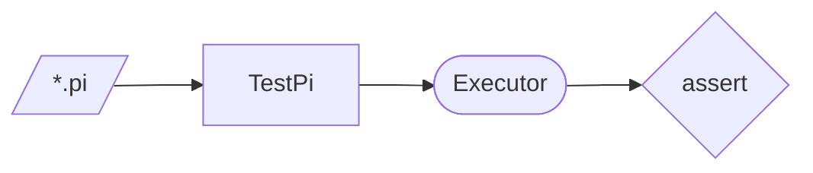

# Pi Test Scripts

Pi is postfix and stack-based: push the arguments, then name the operation.

```pi
1 2 +                   // 3
{ 2 * } 'double #       // store a continuation
{ 3 + } 'add3 #
5 double & add3 & 13 == assert
```

Each script exercises one area of the language and is run by `TestPi`:

| Script | Area |
|--------|------|
| `Arith.pi`, `Operators.pi`, `Compare.pi` | Arithmetic and comparison |
| `Stack.pi` | Stack manipulation |
| `Array.pi`, `ArrayAdvanced.pi` | Arrays |
| `String.pi`, `StringOps.pi` | Strings |
| `Variables.pi`, `LocalScope.pi`, `DataTypes.pi` | Names, scope, types |
| `Conditional.pi` | `if` and `ife` |
| `Continuations.pi`, `0-Cont.pi` | Continuations |
| `ErrorHandling.pi` | Errors |
| `TutorialExample.pi`, `SimpleTest.pi` | Tutorial examples |
| `WIP/` | Work in progress, not run |


