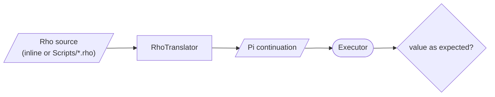

# TestRho

Tests for Rho, KAI's Python-like infix language. Rho is translated to Pi and run on the Executor, so most cases check both the result and, where it matters, the Pi that Rho produced. The suite list is explicit in `Test/Language/CMakeLists.txt`; files in this folder that are not listed there are not built.



Status: every test passes; see [Doc/TEST_SUMMARY.md](../../../Doc/TEST_SUMMARY.md) for counts.

| Area | Example files |
|------|---------------|
| Operators and expressions | `DirectBinaryOpTest.cpp`, `AdditionalBinaryOpTests.cpp`, `AdvancedBinaryOpTests.cpp`, `ExtendedBinaryOpTests.cpp`, `RhoReturnExpressionTest.cpp` |
| Control flow | `RhoControlStructuresTests*.cpp`, `RhoBreakContinueTests.cpp`, `TestElseIf.cpp`, `WhileLoopTest.cpp`, `DoWhileLoopTest.cpp`, `ForLoopTests.cpp`, `ForEachLoopTest.cpp` |
| Iteration | `RhoIterationComprehensiveTests.cpp`, `RhoAllIterationMethodsTest.cpp` |
| Functions, scope, recursion | `RhoFunctionAndScopeTests*.cpp`, `RhoLambdaTests*.cpp`, `RhoRecursion*.cpp`, `FunctionSyntaxTest.cpp` |
| Early return | `RhoEarlyReturnInLoopTests.cpp` |
| Continuations | `RhoAdvancedContinuationTests.cpp` |
| Pi blocks and mixed languages | `RhoPiBlockTests.cpp`, `SimplePiBlockTest.cpp`, `MixedLanguageTest.cpp`, `PiAssertInRhoTest.cpp` |
| Syntax | `SemicolonSyntaxTests.cpp`, `TestForLoopSemicolons.cpp` |
| Shell backticks | `RhoBacktick*Tests.cpp` |
| Script files | `RhoScriptBasedTests.cpp` runs named scripts from [`Scripts/`](Scripts/README.md) |
| Breadth | `RhoComprehensiveTests.cpp`, `RhoAdvancedTests.cpp`, `ExtendedRhoTests.cpp` |

```bash
./Bin/Test/TestRho
./Bin/Test/TestRho --gtest_filter=RhoEarlyReturn*
```

## Historical notes

The files whose names end in `Fixed`, `Workaround` or `Debug`, plus `RhoPiFix.cpp`, date from when the Rho translator wrapped binary operations in their own continuations and many tests failed. That was fixed in the translator (see [Source/Library/Rho](../../../Source/Library/Rho/README.md)). [CONTINUATIONS_Readme.md](CONTINUATIONS_Readme.md), [TestSummary.md](TestSummary.md) and [Todo-Rho.md](Todo-Rho.md) describe that period and are not current.

## See Also

- [Rho Tutorial](../../../Doc/RhoTutorial.md)
- [Rho Language](../../../Doc/RhoLanguage.md)
- [Doc/TODO.md](../../../Doc/TODO.md) for open Rho gaps
