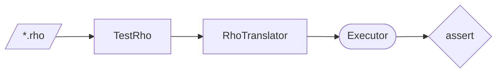

# Rho Test Scripts

Rho is like Python with even less ceremony: indentation-based, no type annotations, functions are values. It is translated to Pi and runs on the same Executor, which supports continuations natively. A function's result is what it leaves on the stack, or what it `return`s.

```rho
fun a(b, c)
    b + c

assert(a(1, 2) == 3)

fun d(e)
    fun f(g)
        g * 2
    f(e)

assert(d(2) == 4)
assert(exists a)
assert(exists d)
assert(!(exists f))

fun h(i, j, k)
    a(i, d(j) * k)

assert(h(1, 2, 3) == 16)
```

Each script ends in assertions or a result; `RhoScriptBasedTests.cpp` in `TestRho` runs them by name and checks each result.



## Continuation mobility

The clearest single-file example of migrating a running computation is [ContinuationMobilityDemo.rho](../../../../Demo/ContinuationMobilityDemo/ContinuationMobilityDemo.rho). The script owns the narrative, the HTML pages only explain it, the executable model is a reference implementation rather than the source of truth, and the script ends by evaluating the restored-agent count. See [Demo/ContinuationMobilityDemo](../../../../Demo/ContinuationMobilityDemo/Readme.md).
