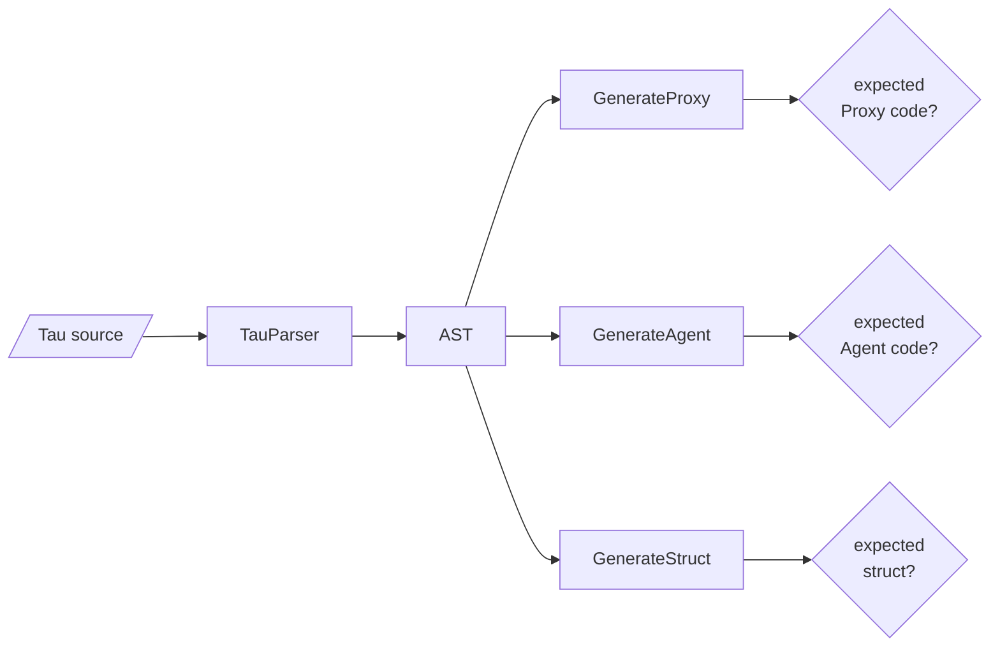

# TestTau

Tests for the Tau IDL: lexer, parser and the Agent/Proxy/struct generators. Built only with `KAI_NETWORKING=ON`. The cases embed their Tau source inline; the `.tau` files in [`Scripts/`](Scripts/README.md) are reference inputs.



| Area | Files |
|------|-------|
| Parsing | `TestTau.cpp`, `TauNamespaceTests.cpp`, `TauClassTests.cpp`, `TauInterfaceTests.cpp`, `TauAdvancedTypeTests.cpp`, `TauTemplateTests.cpp`, `TauAttributeTests.cpp` |
| Generation | `TauCodeGenTests.cpp`, `TauCodeGenerationTests.cpp`, `TauCodeGenerationExtensiveTests.cpp`, `TauGenerateStructTests.cpp`, `TauSeparateGenerationTests.cpp` |
| Futures | `TauFutureProxyTests.cpp`, `TauFutureArgumentCodeGenTests.cpp`, `TauAsyncTests.cpp` |
| Over a Node | `TauNodeRoundTripAndFutureTests.cpp`, `TauProxyAgentCommunicationTest.cpp`, `NetworkConnectionTests.cpp`, `ChatP2PConsoleTest.cpp` |
| Breadth and edge cases | `TauComprehensiveTests.cpp`, `TauCenturyTests*.cpp`, `TauVeryComplexTests.cpp`, `TauEdgeCaseTests.cpp`, `TauStressTests.cpp` |

```bash
./Bin/Test/TestTau
./Bin/Test/TestTau --gtest_filter=TauFutureProxy*
```

See [Tau](../../../Include/KAI/Language/Tau/README.md).
