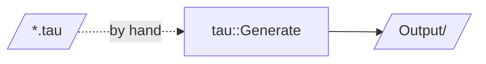

# Tau Test Scripts

Reference `.tau` inputs for the Tau lexer, parser and generators. `TestTau` embeds its Tau source inline, so these are not run automatically; use them to try the parser and generators by hand.

| Script | Tests |
|--------|-------|
| `Tau0.tau`, `Tau1.tau`, `Tau2.tau` | Basic syntax |
| `NumberTest.tau` | Integer, float and scientific literals |
| `AssignmentTest.tau` | Field assignments and default parameter values |
| `InheritanceTest.tau` | Inheritance |
| `NestedNamespaces.tau`, `NamespaceStructure.tau` | Nested namespaces, including `A::B::C` |
| `ClassWithArrays.tau`, `ComplexClassFeatures.tau`, `GenericClasses.tau`, `VisibilityModifiers.tau` | Class features |
| `ComplexProxy.tau` | Proxy generation for several classes |
| `TestCalculator.tau` | A small service interface |
| `ErrorTest.tau` | Intentional errors |
| `Connection/` | Connection interfaces |

Generated code written to disk goes in [`Output/`](Output/README.md).
