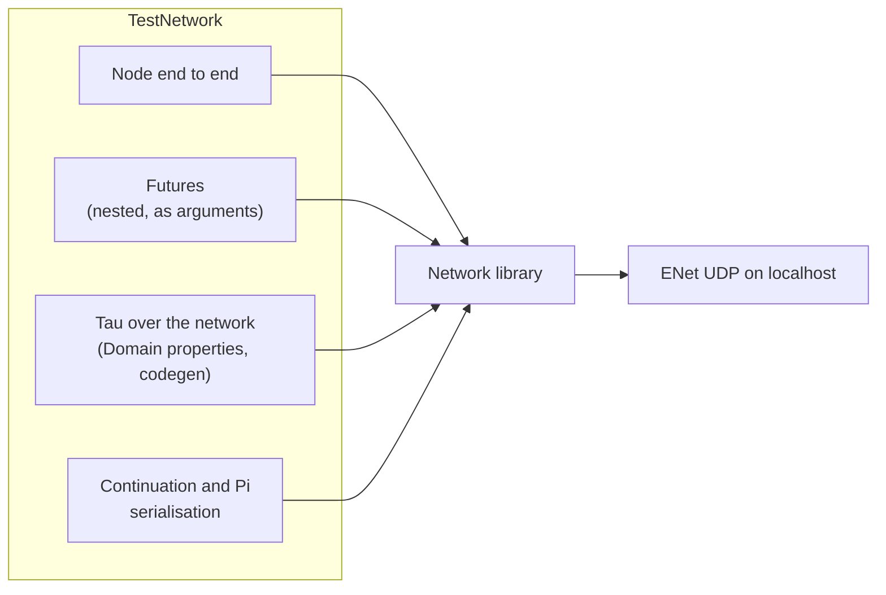

# Network Tests

Tests for Nodes, Domains, futures, Tau over the network and continuation serialisation. Built when `KAI_NETWORKING=ON` (the default).



## TestNetwork

| File | Covers |
|------|--------|
| `NodeEndToEndTest.cpp` | Two Nodes connecting and exchanging calls |
| `NodeFutureArgumentTest.cpp`, `NodeFutureArgumentThreadTest.cpp`, `NodeFutureNetworkParamTests.cpp` | `Future<T>` as RPC arguments |
| `NestedFutureTest.cpp`, `NestedFutureParamTests.cpp`, `NestedFutureTripleTest.cpp` | `Future<Future<T>>` and deeper |
| `TauDomainPropertyTest.cpp` | Properties through a Domain's Agents and Proxies |
| `TauNetworkCommunicationTest.cpp` | Generated Proxy and Agent talking over a Node |
| `TauCodeGenParamTests.cpp`, `TestGenerateProxy.cpp` | Generated code for network parameters |
| `TauPiSerializationTest.cpp`, `ContinuationSerializationTest.cpp` | Freezing Pi values and continuations to a `BinaryStream` and back |
| `NetworkAdditionalTests.cpp`, `NetworkAddressCenturyTests.cpp` | Addresses, connections, edge cases |

```bash
./Bin/Test/TestNetwork
./Bin/Test/TestNetwork --gtest_filter="TauDomainPropertyTest*"
ctest --test-dir build -R TestNetwork
```

## Standalone programs

| Program | Purpose |
|---------|---------|
| `ConsoleConnectionTest` | Console networking integration |
| `IntegratedConsoleTest` | Console with network calculations |
| `CalculationTest` | Distributed calculation |
| `Test_ProxyGeneration` (in `ProxyTest/`) | Proxy generation |

## Not built

The chat tests (`ChatFunctionalityTests.cpp`, `ChatAdvancedTests.cpp`, `ChatProxyGenerationTest.cpp`, `ICQStyleChatTest.cpp`) and `ChatDemo.rho` are kept for reference but are not in any target.

## Demos

```bash
./Test/demo_console_communication.sh                        # tmux console-to-console demo
./Scripts/network/run_continuation_migration_demo.sh        # freeze, send, thaw, resume: returns 42
```

Tests connect over localhost only.

## See Also

- [Console Networking](../../Doc/CONSOLE_NETWORKING.md)
- [Network Architecture](../../Doc/NetworkArchitecture.md)
- [Peer to Peer](../../Doc/PeerToPeerNetworking.md)
- [Connection Testing](../../Doc/ConnectionTesting.md)
- [Network library](../../Source/Library/Network/Source/README.md)
