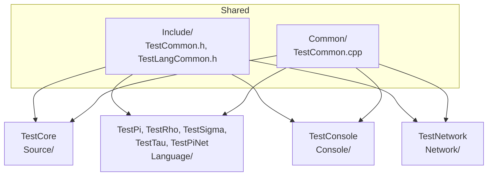

# Tests

GoogleTest suites for the core, the languages, the console and the network. Test executables are written to `Bin/Test/`. `py run_tests.py` (or `ctest --test-dir build`) runs everything; see [Doc/TEST_SUMMARY.md](../Doc/TEST_SUMMARY.md) for the current counts.



## Executables

| Executable | Folder | Covers |
|------------|--------|--------|
| `TestCore` | [Source](Source/README.md) | Registry, types, reflection, GC, BinaryStream, containers, LLM utilities |
| `TestPi` | [Language/TestPi](Language/TestPi/README.md) | Pi: stack, control flow, continuations, Suspend/Resume/Replace |
| `TestRho` | [Language/TestRho](Language/TestRho/README.md) | Rho: expressions, control flow, functions, closures, translation to Pi |
| `TestSigma` | `Language/TestSigma` | Sigma: type checking, generated Rho, example programs, `&` and `!` |
| `TestPiNet` | `Language/TestPiNet` | PiNet: which continuations may be sent |
| `TestTau` | [Language/TestTau](Language/TestTau/README.md) | Tau parsing and Agent/Proxy generation (needs networking) |
| `TestConsole` | [Console](Console/README.md) | Console commands, history, languages, networking |
| `TestNetwork` | [Network](Network/README.md) | Nodes, Domains, futures, Tau over the network, continuation serialisation |

Also built: `LogTest`, `PerformanceTests`, `Test_ProxyGeneration`, `ContinuationMobilityDemoTests` and `ksh_tests`, plus the standalone network programs `ConsoleConnectionTest`, `IntegratedConsoleTest` and `CalculationTest`. Shell command tests are script-driven ([ShellCommandTests](ShellCommandTests/README.md)). The [Window](Window/README.md) tests are not in the default build.

## Folders

| Folder | Contents |
|--------|----------|
| [Include](Include/README.md) | Shared test headers |
| `Common` | Shared test sources |
| [Source](Source/README.md) | Core tests |
| [Language](Language/README.md) | One folder per language |
| [Console](Console/README.md) | Console tests |
| [Network](Network/README.md) | Network tests |
| [ShellCommandTests](ShellCommandTests/README.md) | Shell integration tests |
| [Window](Window/README.md) | ImGui window tests |
| `Examples`, `LogTest`, `Performance`, `Standalone` | Example, logging, performance and standalone tests |

## Selecting tests

```bash
./Bin/Test/TestPi --gtest_filter=PiBinaryOpTests.*
./Bin/Test/TestPi --gtest_filter=PiBinaryOpTests.IntegerAddition
ctest --test-dir build -R TestSigma
```

## Coloured output

On by default: green for INFO, yellow for WARNING, red for ERROR, grey for console metadata. `--no-color` turns it off. See [ColorOutput.md](../Doc/ColorOutput.md).

## See Also

- [Test guide](../Doc/Test.md)
- [Test summary](../Doc/TEST_SUMMARY.md)
- [Connection testing](../Doc/ConnectionTesting.md)
- [Log format](../Doc/LogFormat.md)
