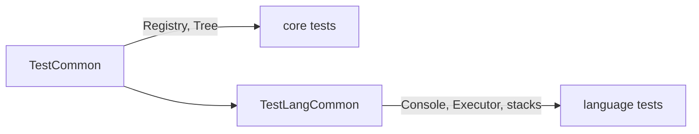

# Shared Test Fixtures

Code used by many test suites. Headers are in [`Test/Include`](../../Include/README.md); sources are in `Test/Common` and `Test/Language/TestLangCommon.cpp`.

## TestCommon

A minimal `Registry` and `Tree`. The base class for tests that only need a Registry.

## TestLangCommon

A fuller environment: a `Console` with its `Executor`, and direct access to the data and context stacks. The base for tests that simulate a user at the console, and for the language suites (Pi, Rho, Sigma, PiNet).

**Note:** despite the names, neither runs any tests itself. They are fixtures.
